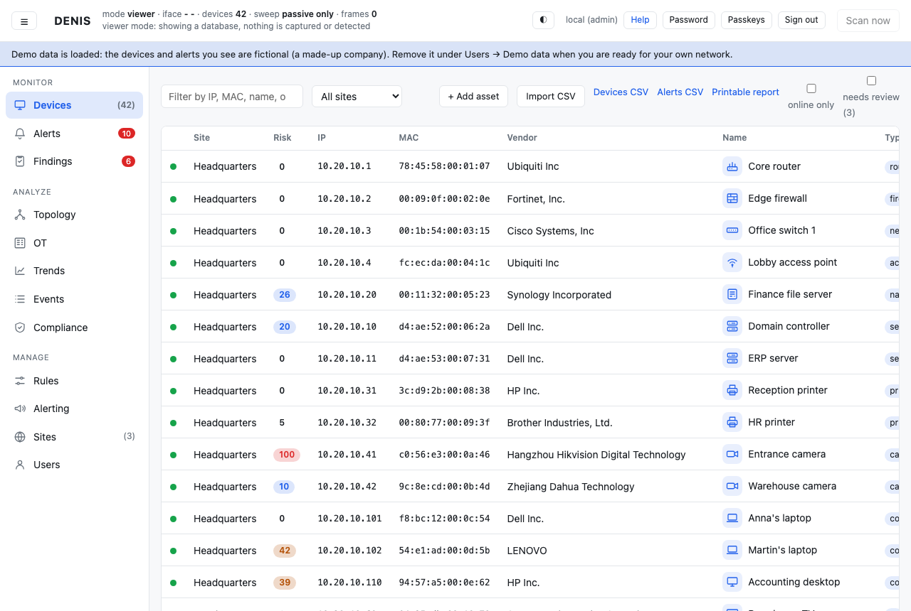
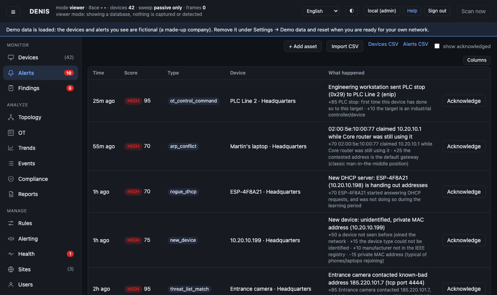
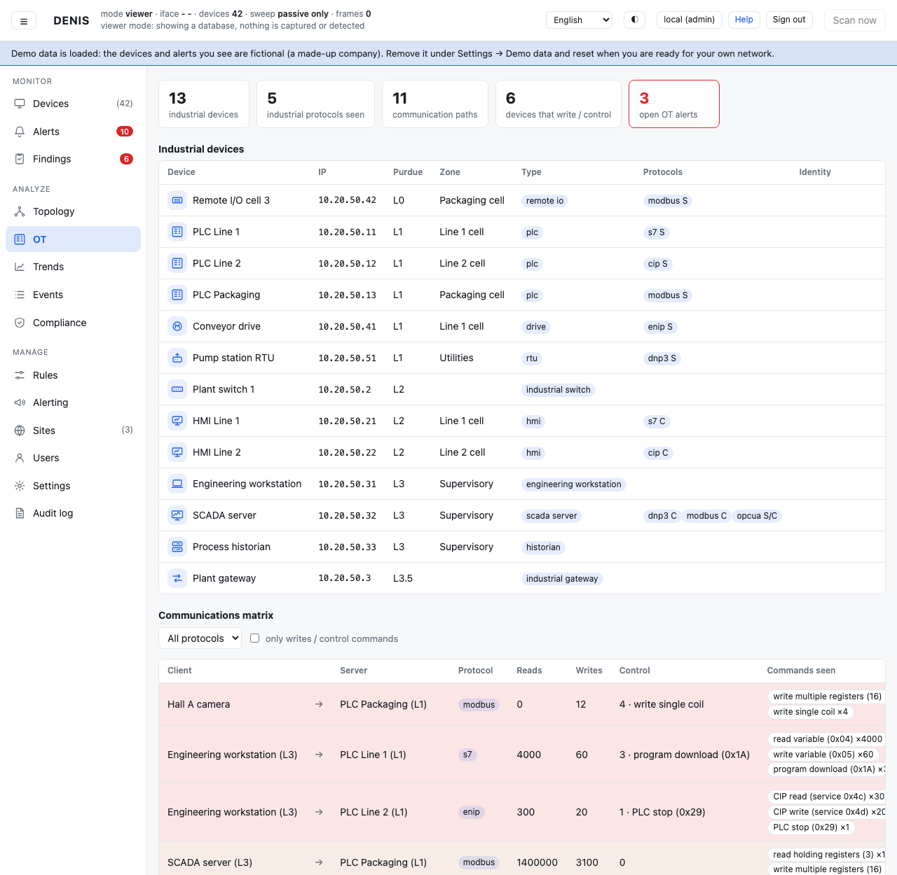
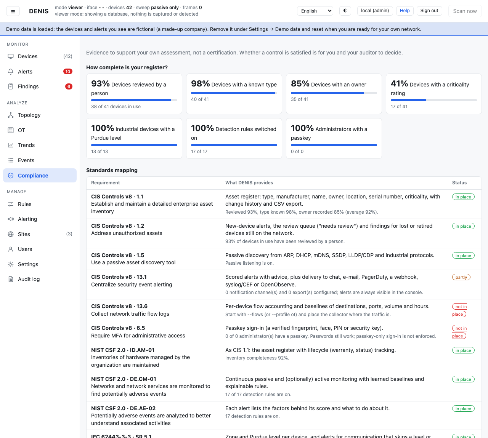
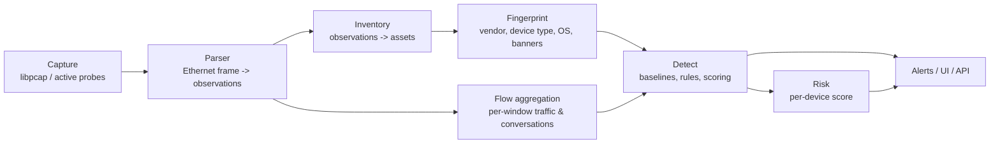

# DENIS

**Know every device. Understand every connection.**

Network visibility and security monitoring for **IT, IoT and OT** — passive-first, self-hosted, one Rust binary,
source-available.

[](https://github.com/stefanmesaros/denis/actions/workflows/ci.yml)
[](https://github.com/stefanmesaros/denis/releases/latest)
[](LICENSE)

DENIS is **not** a SIEM, an AI security platform or a SOC replacement. It is the layer underneath those things: an
always-current inventory of what is actually on your network, who each device talks to, and an explainable alert
the moment that changes.



**[See DENIS in action →](#demo-try-denis-without-installing-a-sensor)** no capture, no login, a fictional company already loaded.

---

## The problem

Most small IT teams know their laptops and servers. They usually do **not** have a current answer for:

* What is actually on my network — every printer, camera, smart-plug, PLC, someone's personal router?
* What *is* this device, and how sure are we?
* Who is it talking to, and is that normal?
* What changed since yesterday?
* Of everything flagged, what should I look at first?

Spreadsheets go stale the day after you write them. DENIS answers these questions continuously, by watching the
network itself rather than trusting whatever was last typed into a CMDB.

## What DENIS does

1. **Discover.** Passive listening (ARP, DHCP, mDNS, SSDP, LLDP/CDP, PROFINET, TCP/IP stack fingerprints) plus
   polite active discovery (ARP sweep, ping, port scan). Industrial devices are only ever listened to, never
   probed.
2. **Identify.** Manufacturer from the IEEE OUI registry; device type and operating system from weighted evidence
   (DHCP option lists, mDNS, SSDP, open ports, names…) — every guess lists the rules behind it, and your correction
   always wins. Where a service reveals it, DENIS reads the product and version from nine banners (SSH, FTP, SMTP,
   HTTP, Telnet, MySQL/MariaDB, SMB, MSSQL).
3. **Understand.** A per-device traffic baseline (destinations, ports, volume, active hours — needs `--flows`), an
   industrial communications matrix (who talks to whom, over which protocol, reads vs. writes vs. control), and
   "Top talkers" leaderboards for who is moving the most data.
4. **Detect, with a score you can read.** New device, rogue DHCP server, ARP hijack / gateway takeover, a new
   destination or port, unusual volume or hour, a device gone silent, a burst of newcomers, contact with a
   known-bad address — each scored 0–100 with the factors behind the score and what to do about it. No black-box
   number: every point is attributed to a named reason.
5. **Protect OT.** Passive decoding of Modbus, S7comm, EtherNet/IP-CIP, DNP3, BACnet, OPC UA and IEC 60870-5-104;
   alerts for control commands (a PLC stop, a program download), traffic crossing the network boundary, Purdue-level
   skipping, and writes from a device that should only ever read.
6. **Manage the register.** Owner, location, serial number, asset tag, warranty, criticality, tags, custom fields,
   80+ icons, 90+ device types, full change history, a review queue for new devices, CSV import/export.
7. **Report.** *Findings* (known-exploited vulnerabilities and end-of-support software matched against what a
   device's banner actually revealed, Telnet/RDP exposed, a lost device still online, no owner, an expiring
   warranty…) with **Verify fix** and **Accept risk**; a *Compliance* view showing where your register and
   detections already give you evidence for CIS Controls v8, NIST CSF 2.0, IEC 62443-3-3, NIST SP 800-82,
   ISO/IEC 27001 Annex A, NIS2, DORA, PCI DSS v4.0, HIPAA, SOC 2 and CMMC 2.0; and *Reports* kept on the server to
   view, download or print.

## Why DENIS

* **Visibility first.** You cannot secure a device you do not know exists. Everything else follows from a
  complete, current register.
* **Passive-first, safe for OT.** Discovery leans on listening, not probing; industrial devices are never
  actively scanned. Detections there require a mirror/SPAN port, by design.
* **Explainable, not a black box.** Every score names the rules that produced it. Every device-type or OS guess
  lists its evidence. If DENIS is wrong, your correction always wins over its guess.
* **Self-hosted, one binary.** No agents on end devices to deploy, no external service to trust with your network
  data, no database server to run. `denis run` is the whole install.
* **IT, IoT and OT in one place**, instead of a separate tool (and a separate learning curve) for each.

## Real example

*(what this looks like in the console, from the actual detection logic — not a hypothetical)*

1. A device DENIS has never seen answers a DHCP request. It gets added to the register immediately, flagged
   **needs review**, and its manufacturer/type guess appears with the evidence behind it (say, a DHCP option list
   and an mDNS name pointing to "Espressif" — an IoT module).
2. For the next **learning period**, DENIS builds a baseline for it: which destinations it talks to, which ports,
   how much data, at what hours. Nothing about this device is alerted on yet — only logged — so the baseline is
   not poisoned by an alert storm on day one.
3. Once the baseline exists, the device is judged against it. If it suddenly talks to a destination it has never
   used, opens a port it never had, or moves far more data than usual, that raises a scored alert — e.g. `new
   destination +40`, `unusual volume for this device +25` — with the exact factors listed.
4. You open the alert, see *why* it fired and *what to do about it*, and either **Acknowledge** it (handled) or, if
   it is a known-good pattern for this device, add an **exception** so it never fires for that device/type/network
   again.

Every step above is real DENIS behaviour (`src/detect.rs`); you can watch it happen yourself in the bundled demo.

## Quick start

### Try DENIS in 2 minutes — no sensor, no real traffic

```bash
./denis demo --db demo.db load && ./denis serve --db demo.db --insecure-no-auth
```

Loads a fictional mid-size company (routers, servers, printers, cameras, laptops, an OT production line — 40+
devices, open alerts, findings, an OT communications matrix already populated) and serves the console with no
login, capturing nothing, on this machine only. The console shows a permanent banner while demo data is loaded:
*"Demo data is loaded: the devices and alerts you see are fictional… Remove it under Settings → Demo data."*
Everything is explorable: the register, alert scoring, findings (including known-exploited CVEs and
end-of-support software matched against fictional banners), the OT communications matrix, compliance mapping and
reports — nothing you do here touches a real network. More: [Demo](#demo-try-denis-without-installing-a-sensor).

### Monitor a real network

```bash
./denis run          # prints a one-time admin password; open https://localhost:8080 (self-signed by default)
```

`denis run` needs to see the traffic it should watch. On a normal switch, that means the interface it captures on
(auto-detected, or `--iface`) sees at least ARP/broadcast/multicast traffic for the segment — enough for passive
discovery and the active sweep. **Per-device traffic baselines and OT communications** need more: a **mirror/SPAN
port** (or a network tap) so DENIS actually sees device-to-device traffic, not just what reaches its own NIC — set
one up under *Settings → Network interfaces* and start with `--flows` (or `--profile ot` for an industrial network).

**Install as a permanent service on Linux** (downloads a signed release, creates a `systemd` service, picks a free
port, prints the address and the one-time admin password):

```bash
curl -fLO https://github.com/stefanmesaros/denis/releases/latest/download/install.sh
sudo bash install.sh
```

Details, uninstalling and upgrading: [Deployment](docs/deployment.md). Prefer to read a script before running it as
root? See [Manual installation](docs/deployment.md#without-the-installer) — `less install.sh` first works too, it
just isn't the default above.

**Or with Docker** (a demo, no real capture; see [docs/docker.md](docs/docker.md) for monitoring a real network,
which needs host networking and two Linux capabilities — spelled out there, not hidden in a flag):

```bash
docker compose up demo
```

## Demo: try DENIS without installing a sensor

Covered above in [Quick start](#quick-start) — the same one command loads a fictional company and serves the
console with no login and no capture. Use it to see what DENIS actually looks like before you point it at a real
network, or whenever you just want to look around without touching anything real.

**Documentation** (also inside the console, with screenshots): [Quick start](docs/quickstart.md) ·
[Console tour](docs/tour.md) · [Concepts](docs/concepts.md) · [Asset management](docs/asset-management.md) ·
[Detection rules](docs/detection-rules.md) · [Alerting](docs/alerting.md) · [OT guide](docs/ot-guide.md) ·
[Branding](docs/branding.md) · [Export & SIEM](docs/export.md) · [Deployment](docs/deployment.md) ·
[Docker](docs/docker.md) · [Operations](docs/operations.md) · [Security](docs/security.md) · [API](docs/api.md) ·
[Troubleshooting](docs/troubleshooting.md)

Alerts with the reasoning behind every score, the industrial communications matrix, and compliance mapped against
your actual register — three of the console's 20-odd pages ([more screenshots in the console tour](docs/tour.md)):

<p>



</p>

## Features

| Area | DENIS |
|---|---|
| Discovery | Passive (ARP, DHCP, mDNS, SSDP, LLDP/CDP, PROFINET) + active (ARP sweep, ping, port scan) |
| Asset inventory | Owner, location, serial, tag, warranty, criticality, tags, custom fields, history, CSV import/export |
| Fingerprinting | Vendor (IEEE OUI), device type & OS with weighted, listed evidence; product/version from 9 service banners |
| Anomaly detection | New device, rogue DHCP, ARP hijack/gateway takeover, new destination/port, unusual volume/hour, silent device, known-bad addresses — each with an explainable 0–100 score |
| OT protocols | Modbus, S7comm, EtherNet/IP-CIP, DNP3, BACnet, OPC UA, IEC 60870-5-104 (passive decode) |
| Communications matrix | Who talks to whom, which protocol, reads/writes/control commands |
| SNMP topology | Switch ports, LLDP neighbours, MAC-to-port physical map |
| Vulnerability & EOL findings | Live CISA/NVD known-exploited feed (+ EPSS score) and end-of-support dates, matched per device |
| Alerts | Slack, Teams, Discord, PagerDuty, Pushover, ntfy, e-mail, signed webhook — per-channel threshold, digests, maintenance mode |
| Compliance | CIS v8, NIST CSF 2.0, IEC 62443-3-3, NIST SP 800-82, ISO 27001 Annex A, NIS2, DORA, PCI DSS v4.0, HIPAA, SOC 2, CMMC 2.0 (evidence, not certification) |
| Reports | Saved, scheduled, viewable/downloadable/printable |
| SIEM export | CEF, LEEF or JSON over UDP/TCP/TLS |
| OpenObserve | Cursor-based, at-least-once export |
| Prometheus | `/metrics` exposition |
| REST API | Read the register and alerts, manage assets, API tokens |
| Multi-site agents | Outbound-only agents report to one master; per-user, per-site access |
| White-label | Your logo, colour, default theme |
| Authentication | Roles, passkeys (WebAuthn), Argon2id, lock-outs, audit log, optional built-in HTTPS |
| Self-update | One click; signed release, backup first, automatic rollback if the new version fails to start |

Only what is actually implemented is listed above — see [ROADMAP.md](ROADMAP.md) for what is not (yet).

## Who it's for

* **Small IT teams** who need a real device inventory without buying an enterprise platform.
* **Small and medium-sized businesses** who want to know what is on their network without hiring a security team.
* **MSPs** managing several customer sites from one place (per-site access, white-label).
* **Manufacturing / building automation** that needs OT visibility without touching production traffic.
* **Security-conscious teams** who want explainable detection they can audit, not a black box.
* **Homelabs and researchers** — free for personal, non-commercial use.

## Security and limitations

DENIS is security software; its own trustworthiness matters. Here is the honest state, not a marketing gloss.

**Verified today:** 500+ unit tests and an end-to-end replay of a simulated industrial network through the whole
pipeline; fuzz tests of every parser; `cargo audit` clean; a master and agent talking over HTTP; the UI exercised
in a browser (sign-in, forced password change, editing, users, OT, topology, trends, reports); a real Linux server
running DENIS as a permanent `systemd` service, including a real one-click self-update (backup, verified
signature, atomic swap, automatic rollback on failure); ARP-conflict detection on a real, live network (confirmed
in production, not only against hand-built frames and replay).

**Not yet independently verified:**

* Agent ↔ master **across a real network** (loopback only so far). Built-in TLS (`--tls-cert/--tls-key`, agent
  `--master-ca`) was verified on loopback with a private CA, not yet with a public certificate authority or a
  reverse proxy in front.
* Industrial (OT) detections on **real** industrial traffic (tested with hand-built frames and replay; no real
  OT traffic generated on a live network yet — ARP-conflict detection itself is confirmed in production, see above).
* The OpenObserve and SIEM (syslog: CEF/LEEF/JSON) exports against a real endpoint, not a simulated one.
* The SMB and MSSQL banner readers against a real Windows Server or SQL Server (fuzz-tested and verified against
  hand-built packets matching each protocol's specification only).
* German, French and Spanish translations (complete — a test fails if a string is missing — but only Slovak has
  been reviewed by a native-speaking security professional).
* No SSO, no PostgreSQL backend, no IPv6, no Windows build.
* **An independent penetration test.** Required, and not yet done, before relying on DENIS in a commercial
  production setting. If you are able to run one, please [get in touch](SECURITY.md).

Full detail: [docs/security.md](docs/security.md) (what DENIS does *not* protect against) and
[SECURITY.md](SECURITY.md) (how to report a problem).

## Architecture



One process, one SQLite database. An **agent** runs the same capture → detect pipeline at a remote site and reports
deltas to a **master** over outbound HTTP(S); the master never opens a connection into the agent's network. See
[docs/operations.md](docs/operations.md) for the deployment topology and [docs/concepts.md](docs/concepts.md) for
how the pieces fit together.

## Industrial (OT)

Passively decoded: **Modbus, S7comm, EtherNet/IP-CIP, DNP3, BACnet, OPC UA, IEC 60870-5-104**. DENIS builds a
communications matrix (who talks to whom, which functions, reads vs. writes vs. control) and raises alerts for
control commands, boundary crossings and Purdue-level violations — all from **listening only**; industrial devices
are never sent probes, port scans or credentials. This is a deliberate safety boundary, not an oversight: a probe
that a fragile PLC mishandles is a production incident. See the [OT guide](docs/ot-guide.md) for what "safe" means
here in more detail, and the **Not yet independently verified** section above for what real-traffic testing is
still owed before you rely on this in a live industrial environment.

## Compliance

DENIS maps what your register and detections already show to controls in CIS Controls v8, NIST CSF 2.0,
IEC 62443-3-3, NIST SP 800-82, ISO/IEC 27001:2022 Annex A, NIS2 Article 21, DORA, PCI DSS v4.0, the HIPAA Security
Rule, SOC 2 (Trust Services Criteria) and CMMC 2.0.

**This is evidence for your own assessment, not a certification.** DENIS does not make you compliant with anything;
it shows which controls your current visibility and findings already support, which are partial, and which are
not addressed at all — so you and your auditor can decide. Print the Compliance page to keep a dated copy.

## Integrations

**Notifications:** Slack, Microsoft Teams, Discord, PagerDuty, Pushover, ntfy, e-mail (SMTP), a signed generic
webhook.
**Export:** SIEM in CEF, LEEF or JSON over UDP/TCP/TLS; OpenObserve; Prometheus `/metrics`; a REST API;
`denis backup` for the database itself.

Only integrations that exist today are listed; see [docs/export.md](docs/export.md) and
[docs/alerting.md](docs/alerting.md) for how to set each one up.

## License

DENIS is **source-available**, not OSI-approved open source: the code is public so you can read, audit and build
it, under the terms of the **DENIS Community License**.

* **Free** for personal, non-commercial use, on a single installation monitoring up to **100 devices**.
* **Any organisational use** (a business, non-profit, government body or other organisation, regardless of size)
  **— or more than 100 devices —** needs a commercial license.

See [LICENSE](LICENSE) for the exact terms and [LICENSE-COMMERCIAL.md](LICENSE-COMMERCIAL.md) for how to get a
commercial license (there is no self-service purchase yet — open a GitHub issue). List of
[third-party software](THIRD-PARTY-LICENSES.md) DENIS depends on, each under its own permissive license.

## Roadmap

What is missing and planned, including gaps competitors already cover (SSO, ticketing/CMDB integrations,
multi-tenancy, IPv6, a Windows collector) and verification still owed before a commercial launch: see
[ROADMAP.md](ROADMAP.md).

## Contributing

Contributions are welcome: [CONTRIBUTING.md](CONTRIBUTING.md), [CODE_OF_CONDUCT.md](CODE_OF_CONDUCT.md). See
[Development](#development) below for the module map.

## Security reporting

Found a vulnerability? Please report it privately through GitHub's private vulnerability reporting, not a public
issue: [SECURITY.md](SECURITY.md).

## Try DENIS

* **[Run the demo](#demo-try-denis-without-installing-a-sensor)** — a fictional company, no capture, no login, one command.
* **[Install it](#quick-start)** — one script for a permanent Linux service, or a single binary anywhere else.
* **[Read the docs](docs/quickstart.md)** — a guided tour of every page, with screenshots.
* **[Open an issue](https://github.com/stefanmesaros/denis/issues)** — bugs, questions, or "how would I use this for…".

---

## Development

```
src/parse.rs        Ethernet frame -> observations (pure, fuzzed)
src/ot.rs           industrial protocol + LLDP/CDP/PROFINET decoders (pure, tested from the specs)
src/flow.rs         per-window aggregation of flows and conversations (capture thread)
src/capture.rs      libpcap thread, kernel filter, throttling
src/active.rs       ARP sweep, ICMP, TCP scan (polite; never used on industrial devices)
src/inventory.rs    observations -> assets, ARP-conflict signals, deltas for agents
src/fingerprint.rs  vendor lookup and the explainable device-type/OS guesser
src/detect.rs       baselines, all rules, scoring, learning periods, communications matrix
src/risk.rs         per-device risk score
src/rules.rs        the rules as the console shows and tunes them
src/demo.rs         built-in demo data (a fictional company)
src/compliance.rs   coverage and standards mapping (CIS / NIST CSF / IEC 62443 / NIST 800-82 / ISO 27001 / NIS2 / DORA / PCI DSS / HIPAA / SOC 2 / CMMC)
src/reports.rs      saved reports and their schedule
src/snmp.rs         SNMP v2c client (BER, GET/GETBULK walks)
src/topology.rs     switches over SNMP: ports, LLDP neighbours, MAC-to-port; the physical map
src/banners.rs      service banners (SSH/FTP/SMTP/HTTP, Telnet/MySQL/MariaDB/SMB/MSSQL) and the product and version in them
src/vulndata.rs     end-of-support dates and known-exploited ranges (bundled, live CISA/NVD/EPSS refresh, custom CVEs)
src/trends.rs       historical trend samples and the Top talkers leaderboard (pure functions)
src/docs.rs         the documentation served inside the console
ui/i18n.js          language handling; texts in tools/i18n/*.tsv -> ui/i18n/*.json (python3 tools/i18n/build.py)
src/metrics.rs      Prometheus exposition
src/threat.rs       blocklist for the threat_list_match rule
src/findings.rs     standing weaknesses and housekeeping problems, with fixes
src/tracking.rs     validated asset edits, CSV import, warranty arithmetic, icons
src/passkey.rs      WebAuthn/passkey verification (ES256, strict)
src/auth.rs         users, sessions, per-agent tokens (Argon2id, hashed tokens, lock-out)
src/web/            API + embedded UI, auth middleware, security headers (mod.rs routes/reads, common.rs shared with web_*)
src/web_admin.rs    state-changing handlers (session, users, tokens, asset edits, import)
src/web_siem.rs     SIEM / log export settings (GET/PUT, a test-send endpoint)
src/ingest.rs       master side of the agent protocol (per-agent tokens, idempotent batches)
src/agent.rs        agent reporter
src/tls.rs          optional built-in HTTPS (rustls)
src/update.rs       one-click self-update: signed release check, download, verify, backup, atomic swap, rollback
src/engine.rs       collector + detector + web wiring (`run`, `run_agent`)
src/store/          `Store` trait (split into focused sub-traits) + SQLite (schema v14, transactional migrations)
src/branding.rs     white-label settings and safe logo handling
src/channels.rs     notification channels (Slack/Teams/Discord/PagerDuty/Pushover/ntfy/e-mail/webhook)
src/syslog.rs       SIEM export: syslog in CEF, LEEF or JSON, over UDP/TCP/TLS
src/sink.rs         OpenObserve exporter (cursor-based, at-least-once)
src/report.rs       CSV / printable HTML (escaping, formula-injection guard)
ui/                 the web UI (plain JS, no build step, strict CSP)
docs/               user documentation
tests/              end-to-end replay tests
```

```bash
cargo test && cargo clippy --all-targets && cargo audit
```

Code is commented for maintainers: module headers state each module's purpose and invariants (what is trusted,
what is bounded), and non-obvious decisions say *why*.
