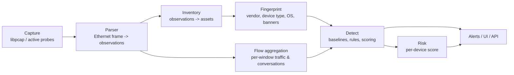

# DENIS Community

**Know every device on your network, who it talks to, and when that changes — with every alert explained.**

DENIS is a self-hosted, passive network visibility tool for IT, IoT and OT environments. It listens to the
traffic already on your wire (ARP, DHCP, mDNS, SSDP, LLDP/CDP, PROFINET and the major industrial protocols),
builds an always-current inventory of every device, learns what normal looks like for each one, and raises an
alert when something departs from that baseline. Each alert carries a 0–100 score where every point is
attributed to a named reason — never a black box.

[](https://github.com/stefanmesaros/denis/releases/latest)
[](LICENSE)

DENIS is **not** a SIEM, an AI security platform, a SOC replacement or a UTM/firewall appliance. It does not sit
inline and it does not block anything — it is a passive, out-of-band layer underneath those things: an
always-current inventory of what is actually on your network, who each device talks to, and an explainable alert
the moment that changes. A UTM controls what crosses your perimeter; DENIS shows what is happening *inside* it,
including the east-west and OT/industrial traffic a perimeter box was never in a position to see.

**DENIS Community** is free, ships as pre-built signed binaries, runs entirely on your own hardware, and never
sends your traffic anywhere. GeoIP, vulnerability, end-of-life and threat-list data are all held locally. A
commercial license is available for organisational use beyond the Community edition's personal / 100-device
scope — see [License](#license).


**[See DENIS in action →](#demo-try-denis-without-installing-a-sensor)** no capture, no login, a fictional company already loaded.

## What's new in 3.5.1

**Fixes and console polish.** An incident you closed opens again from the list, and incidents have
one AI button: a saved assessment is shown on request, and "Ask again" runs a fresh one. The device
page has one action bar, the sign-in screen appears at once, and the look (Default or Deep Field)
is now chosen under My account rather than in the header. Full notes in the
[changelog](CHANGELOG.md).

## What's new in 3.5.0

**Control coverage.** A Coverage view shows which devices are managed, in your directory, scanned
and protected by endpoint security, with the evidence for each, and keeps "DENIS checked and found
nothing" apart from "DENIS could not check". Missing controls become findings, a daily history lets
you set goals and watch the numbers move, and Microsoft Defender for Endpoint is a new source. See
[Coverage](docs/coverage.md).

**One workflow for alerts, incidents and findings.** Incidents are open, acknowledged or resolved,
resolving needs an outcome, every decision is recorded with who, when and why (kept three years by
default), and incidents and findings link both ways. See [Incidents](docs/incidents.md).

**Watches and policies, closer together.** Watches are listed with your policies, share one device
picker with them, and can follow a zone, with a preview of which devices they cover today. See
[Segmentation](docs/segmentation.md).

## What's new in 3.4.0

**Zones and segmentation policies.** Group devices into zones, write allow-list and
zone-boundary policies, and get an alert when traffic crosses a boundary your policies don't
allow. A zone × zone matrix shows what's actually been verified, honestly separating "nothing
seen" from "not covered" when traffic recording is off. A new policy starts in a silent
record-only mode; "freeze this device's behaviour" turns its own observed traffic into a
reviewable starting policy, never saved until you confirm it.

**Passive DNS, opt-in.** DENIS can remember the name that resolved to each address your own
devices contacted, so connections show a name instead of a bare IP wherever one already appeared —
the device panel, alert evidence, Ask DENIS's own destination search (which can now search by
domain name, not just an IP). Off by default, with its own retention and a one-click "delete
everything recorded". A new rule flags a device being pointed at an unexpected DNS resolver.

**Deep Field: an optional animated look for the Topology map.** A quiet star-field background, a
slow pulse on your gateway showing the page is live, and a brighter pulse on a fresh alert — off
by default, and scoped to the Topology page only.

## What's new in 3.3.0

**Multiple customers on one installation.** Separate databases, detectors and consoles per
customer, with nothing reachable across them; MSP technician accounts that work across customers
without a separate login in each one; export or import a customer as a standalone database.

**Optionally disable a switch port, from DENIS.** For a switch DENIS already monitors over SNMP:
one access port at a time, with a preview of what's behind it, a reason, your password, and
one-click undo. DENIS never blocks anything on its own — this is an administrator's action, never
automatic.

**Track a fix until it's actually fixed.** Assign a finding to a person with a due date and a
linked Jira/ServiceNow ticket; DENIS confirms the fix itself (a rescan, or no further contact while
the device stays online) and watches for 30 days in case it comes back. Also closes the gap where
two collectors watching the same network could leave a device listed twice after being joined.

**Is it your connection, or is it DENIS?** A one-click, 10-20 second test of packet loss, jitter
and latency — not a speed test — rated separately for browsing, a video call, and 1080p/4K
streaming, with a note on whether DENIS's own network activity was the cause.

**More threat intelligence, and certificate/TLS findings.** ThreatFox, URLhaus, Spamhaus ASN-DROP
and the Tor exit list join the existing Feodo Tracker and Spamhaus DROP, each opt-in and named on a
hit. An opt-in probe reads TLS certificates and protocol/cipher strength on your own devices'
already-open ports, flagging an expired, soon-to-expire, self-signed or weak-TLS certificate.

**Ask DENIS can now draft, not just answer.** A follow-up like "add an exception for that" or
"this rule is too sensitive" drafts the exact change — a new rule, an exception, or a setting
change — for an administrator to review and apply with one click. It never changes anything by
itself.

See [CHANGELOG.md](CHANGELOG.md) for the complete list, including smaller fixes.

---

## The problem

Most small IT teams know their laptops and servers. They usually do **not** have a current answer for:

* What is actually on my network — every printer, camera, smart-plug, PLC, someone's personal router?
* What *is* this device, and how sure are we?
* Who is it talking to, and is that normal?
* What changed since yesterday?
* Of everything flagged, what should I look at first?

Spreadsheets go stale the day after you write them. DENIS answers these questions continuously, by watching the
network itself rather than trusting whatever was last typed into a CMDB.

## What DENIS does

1. **Discover.** Passive listening (ARP, DHCP, mDNS, SSDP, LLDP/CDP, PROFINET, TCP/IP stack fingerprints) plus
   polite active discovery (ARP sweep, ping, port scan). Industrial devices are only ever listened to, never
   probed.
2. **Identify.** Manufacturer from the IEEE OUI registry; device type and operating system from weighted evidence
   (DHCP option lists, mDNS, SSDP, open ports, names…) — every guess lists the rules behind it, and your correction
   always wins. Where a service reveals it, DENIS reads the product and version from nine banners (SSH, FTP, SMTP,
   HTTP, Telnet, MySQL/MariaDB, SMB, MSSQL).
3. **Understand.** A per-device traffic baseline (destinations, ports, volume, active hours — needs `--flows`), an
   industrial communications matrix (who talks to whom, over which protocol, reads vs. writes vs. control), "Top
   talkers" leaderboards for who is moving the most data, and — for any public IP address mentioned anywhere —
   country (flag included), ASN, AS organisation and reverse-DNS hostname from a local GeoIP database (DB-IP Lite
   by default, auto-updated monthly, or your own licensed MaxMind file), never a live lookup that sends your
   traffic's addresses to a third party. **Relationships** (opt-in for traffic between your own devices): with
   east-west recording switched on (Settings → Network interfaces, off by default), DENIS also keeps which of your
   devices talked to which, over which protocol and port, first and last seen, and whether it saw who opened the
   connection or only guessed from the ports — the lateral-movement view a perimeter device never has.
4. **Detect, with a score you can read.** New device, rogue DHCP server, ARP hijack / gateway takeover, a new
   destination or port, unusual volume or hour, a device gone silent, a burst of newcomers, contact with a
   known-bad address — each scored 0–100 with the factors behind the score and what to do about it. No black-box
   number: every point is attributed to a named reason. An alert's **Investigate** section shows it in context:
   the device's other events an hour either side, what was recorded between the device and the other party,
   which other devices contacted that same party, and the incident it belongs to.
5. **Protect OT.** Passive decoding of Modbus, S7comm, EtherNet/IP-CIP, DNP3, BACnet, OPC UA and IEC 60870-5-104;
   alerts for control commands (a PLC stop, a program download), traffic crossing the network boundary, Purdue-level
   skipping, and writes from a device that should only ever read.
6. **Manage the register.** Owner, location, serial number, asset tag, warranty, criticality, tags, custom fields,
   120+ icons, 120+ device types, full change history, a review queue for new devices, CSV import/export.
   Optionally cross-referenced against **Microsoft Entra ID, Intune, on-premises Active Directory, Jamf Pro, and
   Azure / AWS / GCP virtual machines** (CMDB import, Settings → Integrations): read-only, matched by exact
   hostname, shown as extra context (OS, compliance state, power state) — never used to override a device's own
   fingerprinted identity. A Nessus / Tenable.io scanner's findings can be imported the same way, matched by IP
   then hostname.
7. **Report.** *Findings* (known-exploited vulnerabilities and end-of-support software matched against what a
   device's banner actually revealed, Telnet/RDP exposed, a lost device still online, no owner, an expiring
   warranty…) with **Verify fix** and **Accept risk**; a *Compliance* view showing where your register and
   detections already give you evidence for CIS Controls v8, NIST CSF 2.0, IEC 62443-3-3, NIST SP 800-82,
   ISO/IEC 27001 Annex A, NIS2, DORA, PCI DSS v4.0, HIPAA, SOC 2 and CMMC 2.0; and *Reports* kept on the server to
   view, download or print. **Top exposures today**, on the Dashboard and each device's panel, ranks the devices
   that most need attention (a known-exploited vulnerability, critical scanner results, unsupported software, an
   open incident, a high-severity finding, weighed by what is at stake on the device), every point listed with
   where it came from.

## Why DENIS

* **Visibility first.** You cannot secure a device you do not know exists. Everything else follows from a
  complete, current register.
* **Passive-first, safe for OT.** Discovery leans on listening, not probing; industrial devices are never
  actively scanned. Detections there require a mirror/SPAN port, by design.
* **Explainable, not a black box.** Every score names the rules that produced it. Every device-type or OS guess
  lists its evidence. If DENIS is wrong, your correction always wins over its guess.
* **Self-hosted, one binary.** No agents on end devices to deploy, no external service to trust with your network
  data, no database server to run. `denis run` is the whole install.
* **IT, IoT and OT in one place**, instead of a separate tool (and a separate learning curve) for each.

## Real example

*(what this looks like in the console, from the actual detection logic — not a hypothetical)*

1. A device DENIS has never seen answers a DHCP request. It gets added to the register immediately, flagged
   **needs review**, and its manufacturer/type guess appears with the evidence behind it (say, a DHCP option list
   and an mDNS name pointing to "Espressif" — an IoT module).
2. For the next **learning period**, DENIS builds a baseline for it: which destinations it talks to, which ports,
   how much data, at what hours. Nothing about this device is alerted on yet — only logged — so the baseline is
   not poisoned by an alert storm on day one.
3. Once the baseline exists, the device is judged against it. If it suddenly talks to a destination it has never
   used, opens a port it never had, or moves far more data than usual, that raises a scored alert — e.g. `new
   destination +40`, `unusual volume for this device +25` — with the exact factors listed.
4. You open the alert, see *why* it fired and *what to do about it*, and either **Acknowledge** it (handled) or, if
   it is a known-good pattern for this device, add an **exception** so it never fires for that device/type/network
   again.

Every step above is real DENIS behaviour, not a hypothetical; you can watch it happen yourself in the bundled demo.

## Quick start

### Try DENIS in 2 minutes — no sensor, no real traffic

```bash
./denis demo --db demo.db load && ./denis serve --db demo.db --insecure-no-auth
```

Loads a fictional mid-size company (routers, servers, printers, cameras, laptops, an OT production line — 40+
devices, open alerts, findings, an OT communications matrix already populated) and serves the console with no
login, capturing nothing, on this machine only. The console shows a permanent banner while demo data is loaded:
*"Demo data is loaded: the devices and alerts you see are fictional… Remove it under Settings → Demo data and
reset when you are ready for your own network."*
Everything is explorable: the register, alert scoring, findings (including known-exploited CVEs and
end-of-support software matched against fictional banners), the OT communications matrix, compliance mapping and
reports — nothing you do here touches a real network. More: [Demo](#demo-try-denis-without-installing-a-sensor).

### Monitor a real network

```bash
./denis run          # prints a one-time admin password; open https://localhost:8080 (self-signed by default)
```

`denis run` needs to see the traffic it should watch. On a normal switch, that means the interface it captures on
(auto-detected, or `--iface`) sees at least ARP/broadcast/multicast traffic for the segment — enough for passive
discovery and the active sweep. **Per-device traffic baselines and OT communications** need more: a **mirror/SPAN
port** (or a network tap) so DENIS actually sees device-to-device traffic, not just what reaches its own NIC — set
one up under *Settings → Network interfaces* and start with `--flows` (or `--profile ot` for an industrial network).

**Install as a permanent service on Linux** (downloads a signed release, creates a `systemd` service, picks a free
port, prints the address and the one-time admin password):

```bash
curl -fLO https://github.com/stefanmesaros/denis/releases/latest/download/install.sh
sudo bash install.sh
```

Details, uninstalling and upgrading: [Deployment](docs/deployment.md). Prefer to read a script before running it as
root? See [Manual installation](docs/deployment.md#without-the-installer) — `less install.sh` first works too, it
just isn't the default above.

**Or with Docker** (pulls the published Community image, a demo with no real capture; see
[docs/docker.md](docs/docker.md) for monitoring a real network, which needs host networking and
two Linux capabilities — spelled out there, not hidden in a flag):

```bash
docker compose up demo
```

## Demo: try DENIS without installing a sensor

Covered above in [Quick start](#quick-start) — the same one command loads a fictional company and serves the
console with no login and no capture. Use it to see what DENIS actually looks like before you point it at a real
network, or whenever you just want to look around without touching anything real.

**Documentation** (also inside the console, with screenshots): [Quick start](docs/quickstart.md) ·
[Console tour](docs/tour.md) · [Concepts](docs/concepts.md) · [Asset management](docs/asset-management.md) ·
[Detection rules](docs/detection-rules.md) · [Alerting](docs/alerting.md) · [OT guide](docs/ot-guide.md) ·
[Branding](docs/branding.md) · [Export & SIEM](docs/export.md) · [Deployment](docs/deployment.md) ·
[Docker](docs/docker.md) · [Operations](docs/operations.md) · [Security](docs/security.md) · [API](docs/api.md) ·
[Troubleshooting](docs/troubleshooting.md)

Alerts with the reasoning behind every score, the industrial communications matrix, and compliance mapped against
your actual register — three of the console's 20-odd pages ([more screenshots in the console tour](docs/tour.md)):

<p>


</p>

## Features

| Area | DENIS |
|---|---|
| Discovery | Passive (ARP, DHCP, mDNS, SSDP, LLDP/CDP, PROFINET) + active (ARP sweep, ping, port scan) |
| Asset inventory | Owner, location, serial, tag, warranty, criticality, tags, custom fields, history, CSV import/export |
| Fingerprinting | Vendor (IEEE OUI), device type & OS with weighted, listed evidence; product/version from 9 service banners; JA3/JA3S TLS client & server fingerprints; a fleet-wide *Software* page (product × version × devices) |
| Anomaly detection | New device, rogue DHCP, ARP hijack/gateway takeover, new destination/port, unusual volume/hour, silent device, internal host sweep / port scan, known-bad addresses, your own network watches — each with an explainable 0–100 score. IPv6 (new destination, NDP mismatch, rogue router advertisement) is opt-in |
| OT protocols | Modbus, S7comm, EtherNet/IP-CIP, DNP3, BACnet, OPC UA, IEC 60870-5-104 (passive decode) |
| Communications matrix | Who talks to whom, which protocol, reads/writes/control commands |
| Zones & segmentation policies | Group devices into zones, write allow-list and zone-boundary policies, and get alerted when traffic crosses a boundary your policies don't allow. A zone × zone matrix shows what's actually covered, honestly separating "nothing seen" from "not covered" when traffic recording is off. A new policy starts in a silent record-only mode; "freeze this device's behaviour" turns its own observed traffic into a reviewable starting policy, never saved until you confirm it |
| Relationships (lateral movement) | Which device talks to which, per protocol and port, with first/last seen and how DENIS knows it (observed or inferred; client confirmed by a TCP handshake or guessed from ports); "talks to", "talked to by" and "who has contacted this address" in the API. Traffic between your own devices is recorded only once you switch east-west recording on (off by default), bounded per device, with every limit shown on the Health page |
| Alert investigation | An **Investigate** section on every alert: the device's surrounding timeline, its recorded relationship with the other party, the other devices that contacted the same party, the incident link |
| Dashboard | 12 clickable KPI tiles, trend charts, risk/severity/type breakdowns, **Top exposures today** (devices ranked by known-exploited and critical vulnerabilities, unsupported software, open incidents and high findings, weighed by what is at stake — every point attributed), recent alerts, most at-risk devices — the home screen |
| SNMP topology | Switch ports, LLDP neighbours, MAC-to-port physical map |
| IP enrichment | Country (flag), city, ASN, AS organisation, reverse-DNS hostname for any public IP (Alerts, Events, Recent destinations, IP history) — local GeoIP (DB-IP Lite, auto-updated, or your own MMDB), never sent to a third party |
| Vulnerability & EOL findings | Live CISA/NVD known-exploited feed (+ EPSS score) and end-of-support dates, matched per device — both refreshed weekly by default; your own custom CVEs |
| Threat intelligence | abuse.ch Feodo Tracker, ThreatFox and URLhaus, Spamhaus DROP and ASN-DROP, the Tor exit-node list — each an opt-in, named source on a match; your own list too |
| Certificates & web pages | Opt-in: TLS certificate (expiry, self-signed, weak protocol/cipher) and HTTP page title on already-open ports of your own devices — findings for an expired, expiring, self-signed or weak-TLS certificate |
| Remediation tracking | Assign a finding or exposure to a person, a due date, a linked Jira/ServiceNow ticket; DENIS confirms the fix itself (rescan, or no further contact while the device stays online) and watches for 30 days in case it comes back |
| Connection stability test | One-click, 10-20s test of packet loss, jitter and latency over this browser's link to DENIS and DENIS's own link to your gateway or the internet — rated for browsing, a video call, and 1080p/4K streaming, with a note on whether DENIS's own activity was the cause |
| CMDB / cloud import | Entra ID, Intune, Active Directory (LDAP/LDAPS), Jamf Pro, Azure VMs, AWS EC2, GCP Compute Engine — read-only, matched by hostname, each on its own schedule |
| Vulnerability-scanner import | Nessus / Tenable.io findings, matched by IP then hostname, read-only (Qualys not yet) |
| AI assistant (optional) | Bring your own key (Claude, ChatGPT, Gemini, Grok, or a local OpenAI-compatible model): alert explanation, triage, recommended actions, behaviour-change explanation, a background dashboard summary, "Ask DENIS", a rule-drafting assistant, a report summary — every feature off by default, never in the detection path |
| Alerts | Slack, Teams, Discord, PagerDuty, Pushover, ntfy, e-mail, Jira, ServiceNow, signed webhook — per-channel threshold, digests, maintenance mode |
| Compliance | CIS v8, NIST CSF 2.0, IEC 62443-3-3, NIST SP 800-82, ISO 27001 Annex A, NIS2, DORA, PCI DSS v4.0, HIPAA, SOC 2, CMMC 2.0 (evidence, not certification) |
| Reports | Saved, scheduled (optionally e-mailed as a share link), shareable by link, viewable/downloadable/printable |
| SIEM export | CEF, LEEF or JSON over UDP/TCP/TLS; ECS over Elasticsearch/OpenSearch's Bulk API |
| OpenObserve | Cursor-based, at-least-once export |
| Prometheus | `/metrics` exposition |
| REST API | Read the register and alerts, manage assets, API tokens |
| Multi-site agents | Outbound-only agents report to one master; per-user, per-site access |
| Multi-tenancy | Separate customers on one installation — own database, detector and console each, nothing reachable across them; MSP operator accounts; export/import a customer as a standalone database |
| Port control (NAC) | Optional, administrator-confirmed: disable one switch access port at a time on a switch DENIS already monitors over SNMP, with a preview, a reason, a password and one-click undo. DENIS never blocks anything on its own |
| White-label | Your logo, colour, default theme |
| Authentication | Roles, per-site access, passkeys (WebAuthn, optionally passkey-only), authenticator apps (TOTP), OIDC single sign-on, Argon2id, lock-outs, audit log, built-in HTTPS |
| Data retention | Events, alerts and trend samples pruned after a period you set (Settings → Data); the register itself is never pruned |
| Self-update | One click; signed release, backup first, automatic rollback if the new version fails to start |

Only what is actually implemented is listed above — see [ROADMAP.md](ROADMAP.md) for what is not (yet).

## Who it's for

* **Small IT teams** who need a real device inventory without buying an enterprise platform.
* **Small and medium-sized businesses** who want to know what is on their network without hiring a security team.
* **MSPs** managing several customer sites from one place (per-site access, white-label).
* **Manufacturing / building automation** that needs OT visibility without touching production traffic.
* **Security-conscious teams** who want explainable detection they can audit, not a black box.
* **Homelabs and researchers** — free for personal, non-commercial use.

## Security and limitations

DENIS is security software; its own trustworthiness matters. Here is the honest state, not a marketing gloss.

**Verified today:** 780+ unit and integration tests and an end-to-end replay of a simulated industrial network
through the whole pipeline; fuzz tests of every parser; `cargo audit` clean; a master and agent talking over HTTP;
the UI exercised in a browser (sign-in, forced password change, editing, users, OT, topology, trends, reports); a
real Linux server running DENIS as a permanent `systemd` service, including a real one-click self-update (backup,
verified signature, atomic swap, automatic rollback on failure); ARP-conflict detection on a real, live network
(confirmed in production, not only against hand-built frames and replay); agent ↔ master **across a real network**
(a genuine agent, built from source, run on a VPS in a different country over Tailscale, reporting real devices
back to a home master); a `denis.exe` built from source on a real Windows 11 machine, both reporting as an agent
and capturing real traffic locally (42 devices, port scans, OS fingerprints, a real ARP-conflict alert — see
see below); the AI features against real cloud provider accounts (two real bugs found live with
ChatGPT and Gemini) and a real local Ollama instance.

**Not yet independently verified:**

* Agent ↔ master with TLS from a **public** certificate authority (verified so far only with the built-in
  self-signed one, over Tailscale) or behind a reverse proxy.
* Industrial (OT) detections on **real** industrial traffic (tested with hand-built frames and replay; no real
  OT traffic generated on a live network yet — ARP-conflict detection itself is confirmed in production, see above).
* The OpenObserve, SIEM (syslog: CEF/LEEF/JSON; ECS over Elasticsearch/OpenSearch's Bulk API) and Jira/ServiceNow
  ticketing exports against a real endpoint, not a simulated one.
* The SMB and MSSQL banner readers against a real Windows Server or SQL Server (fuzz-tested and verified against
  hand-built packets matching each protocol's specification only).
* German, French and Spanish translations (complete — a test fails if a string is missing — but only Slovak has
  been reviewed by a native-speaking security professional).
* SSO (OIDC) against a real identity provider, not a mock — signature verification end to end is
  the specific gap.
* The CMDB and cloud imports (Entra ID, Intune, Active Directory, Jamf Pro, Azure, AWS, GCP) and the
  Nessus import against a **real** tenant, directory, instance, subscription, account or project —
  verified so far against hand-written fixtures matching each API's documented shape, and (for the
  cloud sources) a deliberately wrong credential reaching the real endpoint and being refused. See
  itemised internally.
* The SNMP switch reader against real switches from any vendor (tested against two stand-in
  switches and hostile input only; see docs/switches.md).
* IPv6 (opt-in, `--ipv6`/`--ipv6-subnet`: passive discovery, flow accounting, remote-agent
  reporting, the active liveness check) on a genuine dual-stack network — verified so far only
  with hand-built frames and integration tests, not real ICMPv6/NDP traffic or a real socket send.
  Also still IPv4-only: rule parity (rotation-burst suppression, `new_port`, OT decoding, the
  threat list, network watches, `lan_scan`), an NDP-mismatch signal, IPv6 conflict/gateway
  detection, and full active discovery of brand-new addresses.
* No PostgreSQL backend. No **packaged** Windows build: `denis.exe` compiles and has been verified capturing
  on a real Windows 11 machine when built from source with the Npcap SDK. A service wrapper and installer
  script exist but are unverified — neither has run on a real Windows machine yet — and there is still no
  signed release for Windows or a CI job that links it.
* Two collectors on the same network segment (say the master's own capture plus an agent on the same
  LAN) list every device twice; the fix is designed but not built. Run one
  collector per segment until then.
* **An independent penetration test.** Required, and not yet done, before relying on DENIS in a commercial
  production setting. If you are able to run one, please [get in touch](SECURITY.md).

Full detail: [docs/security.md](docs/security.md) (what DENIS does *not* protect against) and
[SECURITY.md](SECURITY.md) (how to report a problem).

## Architecture


```mermaid
flowchart LR
    A[Capture\nlibpcap / active probes] --> B[Parser\nEthernet frame -> observations]
    B --> C[Inventory\nobservations -> assets]
    C --> D[Fingerprint\nvendor, device type, OS, banners]
    B --> E[Flow aggregation\nper-window traffic & conversations]
    D --> F[Detect\nbaselines, rules, scoring]
    E --> F
    F --> G[Risk\nper-device score]
    F --> H[Alerts / UI / API]
    G --> H
```

One process, one SQLite database. An **agent** runs the same capture → detect pipeline at a remote site and reports
deltas to a **master** over outbound HTTP(S); the master never opens a connection into the agent's network. See
[docs/operations.md](docs/operations.md) for the deployment topology and [docs/concepts.md](docs/concepts.md) for
how the pieces fit together.

## Industrial (OT)

Passively decoded: **Modbus, S7comm, EtherNet/IP-CIP, DNP3, BACnet, OPC UA, IEC 60870-5-104**. DENIS builds a
communications matrix (who talks to whom, which functions, reads vs. writes vs. control) and raises alerts for
control commands, boundary crossings and Purdue-level violations — all from **listening only**; industrial devices
are never sent probes, port scans or credentials. This is a deliberate safety boundary, not an oversight: a probe
that a fragile PLC mishandles is a production incident. See the [OT guide](docs/ot-guide.md) for what "safe" means
here in more detail, and the **Not yet independently verified** section above for what real-traffic testing is
still owed before you rely on this in a live industrial environment.

## Compliance

DENIS maps what your register and detections already show to controls in CIS Controls v8, NIST CSF 2.0,
IEC 62443-3-3, NIST SP 800-82, ISO/IEC 27001:2022 Annex A, NIS2 Article 21, DORA, PCI DSS v4.0, the HIPAA Security
Rule, SOC 2 (Trust Services Criteria) and CMMC 2.0.

**This is evidence for your own assessment, not a certification.** DENIS does not make you compliant with anything;
it shows which controls your current visibility and findings already support, which are partial, and which are
not addressed at all — so you and your auditor can decide. Print the Compliance page to keep a dated copy.

## Integrations

**Notifications:** Slack, Microsoft Teams, Discord, PagerDuty, Pushover, ntfy, e-mail (SMTP), Jira, ServiceNow, a
signed generic webhook.
**Export:** SIEM in CEF, LEEF or JSON over UDP/TCP/TLS; Elasticsearch/OpenSearch (ECS over the Bulk API);
OpenObserve; Prometheus `/metrics`; a REST API; `denis backup` for the database itself.
**Import (read-only, into the register as context):** Entra ID, Intune, Active Directory, Jamf Pro, Azure, AWS,
GCP; Nessus / Tenable.io scan findings.
**Sign-in:** OpenID Connect (Entra ID, Okta, Google Workspace, Keycloak, …), passkeys, authenticator apps.
**AI providers (optional, your own key):** Claude, ChatGPT, Gemini, Grok, or any local OpenAI-compatible server
(Ollama, LM Studio, llama.cpp).

Only integrations that exist today are listed; see [docs/export.md](docs/export.md) and
[docs/alerting.md](docs/alerting.md) for how to set each one up. None of the imports has yet been run against
the real service it targets (only against fixtures and, for the cloud ones, a refused wrong credential) — see
[Security and limitations](#security-and-limitations).

## License

DENIS Community is distributed as pre-built, signed binaries under the terms of the **DENIS
Community License** (not an OSI-approved open source license — the source code is maintained
privately). Commercial and enterprise licensing is available separately for organisational use.

* **Free** for personal, non-commercial use, on a single installation monitoring up to **100 devices**.
* **Any organisational use** (a business, non-profit, government body or other organisation, regardless of size)
  **— or more than 100 devices —** needs a commercial license.

See [LICENSE](LICENSE) for the exact terms and [LICENSE-COMMERCIAL.md](LICENSE-COMMERCIAL.md) for how to get a
commercial license (there is no self-service purchase yet — open a GitHub issue). List of
[third-party software](THIRD-PARTY-LICENSES.md) DENIS depends on, each under its own permissive license.

## Roadmap

A single priority-ordered list of what's missing and planned — the rest of IPv6 (most of it shipped,
opt-in), a packaged Windows collector, Qualys
import, SAML (OIDC SSO already works), multi-tenancy, PostgreSQL/HA, and policy enforcement / NAC
(designed, nothing built) — plus verification still owed before a commercial launch: see
[ROADMAP.md](ROADMAP.md).

## Contributing

Bug reports, feature requests and translation corrections are welcome:
[CONTRIBUTING.md](CONTRIBUTING.md), [CODE_OF_CONDUCT.md](CODE_OF_CONDUCT.md).

## Security reporting

Found a vulnerability? Please report it privately through GitHub's private vulnerability reporting, not a public
issue: [SECURITY.md](SECURITY.md).

## Try DENIS

* **[Run the demo](#demo-try-denis-without-installing-a-sensor)** — a fictional company, no capture, no login, one command.
* **[Install it](#quick-start)** — one script for a permanent Linux service, or a single binary anywhere else.
* **[Read the docs](docs/quickstart.md)** — a guided tour of every page, with screenshots.
* **[Open an issue](https://github.com/stefanmesaros/denis/issues)** — bugs, questions, or "how would I use this for…".

