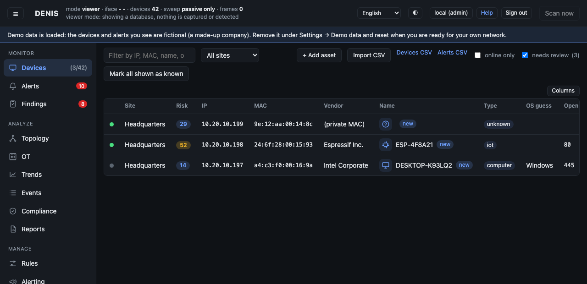

# Quick start

From nothing to a working, useful DENIS in about an hour. Every step says *why*, so you can skip what you do not need.

## 1. What you need

* **macOS or Linux** (Ubuntu 22.04+ recommended for a server). Windows is not supported.
* **Permission to capture packets:**
  * Linux: run as root, or grant it once: `sudo setcap cap_net_raw,cap_net_admin=eip ./denis`
  * macOS: read access to `/dev/bpf*` (Wireshark's *ChmodBPF* does this) or run with `sudo`.
* **Where to put it.** On a normal switched network a machine sees broadcast traffic and its own. That is enough
  to discover devices. To also see who talks to whom, run DENIS on the router/firewall or on a **mirror (SPAN)
  port** ([Concepts › Visibility](concepts.md#visibility-what-can-be-seen-from-where)).
* The pre-built program on Linux needs only the libpcap runtime library (`libpcap0.8`; `libpcap0.8t64` on Ubuntu 24.04),
  which most systems have. Note that a program updated from the console keeps its capture permission only if the
  updater can replace the file in place; run `setcap` again after a manual replacement.
* To build from source: Rust (stable) and libpcap headers (`sudo apt install build-essential libpcap-dev`).

## 2. Build and start

```bash
cargo build --release          # one file, target/release/denis, console and documentation included
./target/release/denis run
```

The first start creates an administrator and prints a **one-time password**. Copy it now, it is shown only once:

```
  ┌─ FIRST START ──────────────────────────────────────────────┐
  │ Created the administrator account:                          │
  │   username: admin                                           │
  │   password: xxxxxxxxxxxxxxxxxxxx                            │
```

Open **https://localhost:8080** (DENIS uses HTTPS by default; your browser will warn once about the certificate DENIS created: see [Deployment](deployment.md#reaching-the-ui-securely-https-is-on-by-default) to trust it or use your own). Sign in as `admin` and choose your own password (at least 12 characters).
Lost it later? `denis user reset admin` on the same machine prints a new one-time password.

Within seconds the **Devices** tab fills up.


## 3. Explore with demo data (optional)

Not on a real network yet, or want to look around first? Sign in as an administrator, open **Users** → **Demo data**
and press **Load demo data**. It fills the console with a fictional company (an office, a production hall with PLCs and
HMIs, a branch site): 42 devices, alerts, industrial communications, trends. Every screen has something to look at.

Demo data is clearly marked and never mixed up with your real devices: a banner says it is loaded, the collector and
detectors ignore it, and **Remove demo data** deletes exactly that and nothing else. When you are ready to use DENIS
for real, remove it (and, if you edited things while exploring, use **Erase all data** in the same place to start from
a clean slate; see [Operations](operations.md#demo-data-and-starting-clean-erase-all-data)).

## 4. The first hour: what to set, in this order

1. **Look at what was found.** Open **Devices**. Each row has an icon, a risk score, the address, the
   manufacturer and a guessed type and operating system. Click a device to see *why* DENIS thinks so.
2. **Work through the review queue.** Tick **needs review** (top right). Every device nobody has looked at
   is listed. Open the unfamiliar ones; for the rest press **Mark all shown as known**. From now on a new device
   stands out ([details](asset-management.md#the-review-queue)).

   
3. **Describe your important devices.** Open a server, NAS or camera → **Edit asset**: a name, an owner, a
   location, a criticality (*high* for things you cannot lose). Correct a wrong device type; your value wins
   everywhere. Or import a spreadsheet: **Devices CSV** → edit → **Import CSV**.
4. **Get alerts where you will see them.** *Alerting* tab → add **Slack**, **Teams**, **e-mail**,
   **PagerDuty** or a **webhook**, press **Test** ([details](alerting.md)).
5. **Let it learn.** For the first 24 hours DENIS *learns*: new devices and destinations are recorded but not
   alerted on (a banner shows the time left). Do not judge the alerts before that is over.
6. **Tune the noise.** *Rules* tab: every detection, with its weight and thresholds. A rule that is too loud for
   you (say new destinations on laptops) can be turned down, not off
   ([details](detection-rules.md)).
7. **Secure the console.** Add a **passkey** (header → *Passkeys*), create one named account per person, and put
   the console behind HTTPS ([Deployment](deployment.md#reaching-the-ui-securely-https-is-on-by-default)).
8. **Look at *Findings* and *Compliance*.** They turn what DENIS knows into a to-do list and into evidence for
   an audit ([tour](tour.md#findings)).

## 5. Options you will use

```bash
denis run --passive-only            # listen only; never send a single packet
denis run --flows                   # also analyse traffic (who talks to what)
denis run --profile ot              # industrial network: passive and gentle (see OT guide)
denis run --listen 127.0.0.1:9000   # another port
denis run --db /var/lib/denis/denis.db
denis run --public-url https://denis.example.com   # the address people type; enables passkeys over HTTPS
denis run --threat-list bad-ips.txt --flows        # alert on contact with known-bad addresses
denis serve --db copy.db            # look at a database (a backup, a copy) without capturing anything
denis backup /safe/place/denis-backup.db           # verified copy of the database, while running
denis --help                        # everything
```

Reading data without the console: `denis list`, `denis alerts`, `denis report`.

## 6. Stopping and starting again

Press **Ctrl-C**. DENIS saves everything and exits; the next start continues where it stopped.
To run it as a service, see [Deployment](deployment.md).
