# The console, tab by tab

Everything DENIS shows or does, in the order you will meet it. Tabs an administrator only sees are marked.
Addresses like `#rules` or `#device/12` can be bookmarked or pasted into a message.

## Header

Product name and logo (yours, see [Branding](branding.md)), a status line (mode, network, devices, last sweep,
health of exports), the **language** picker, the **colour theme** button (auto / day / night), your name (click it for [My account](#my-account)),
**Help** (this documentation), **Sign out** and **Scan now** (an immediate sweep and port scan; disabled in passive-only mode).
A yellow banner appears while **maintenance mode** silences notifications.

## Devices

Every device found. Columns: online dot, risk score, IP, MAC, manufacturer, name (with its icon), type, guessed OS,
open ports, last seen. Click a header to sort; type in the filter box to search IPs, MACs, names, owners, serial
numbers, tags and more. **online only** hides silent devices; **needs review** shows the
[review queue](asset-management.md#the-review-queue). Buttons export the list and alerts (**CSV**), open the
**printable report**, add a device by hand, or import a CSV.

The **risk score** (0–100) is explained factor by factor on the device page: exposed services (Telnet, RDP…),
how well the device is identified, and its open alerts. Devices you rate *critical* weigh more.

### A device

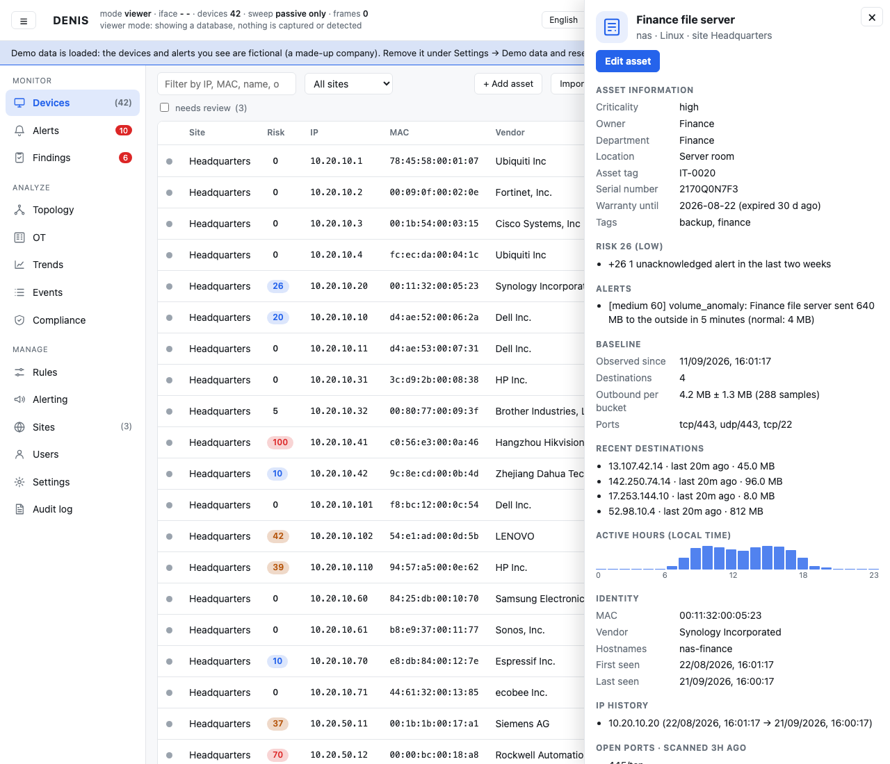

Everything DENIS knows: your data (owner, serial number, warranty…), what it *discovered* and the **evidence
behind each guess** ("Why this guess"), IP history, open ports, the learned **traffic baseline** (usual
destinations, ports, volume, active hours), its alerts and the **change history** of your edits.

### Editing a device

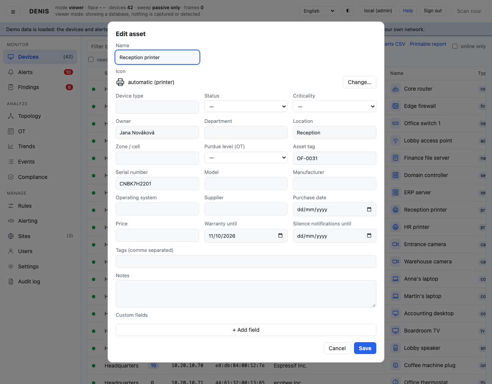

Name, icon, device type, status, criticality, owner, department, location, zone, Purdue level, asset tag, serial
number, model, supplier, purchase and warranty dates, tags and your own custom fields. **Silence notifications
until** stops chat/e-mail alerts about this one device until a date (for a test bench or planned work); alerts still
show in the console. Saving marks the device as reviewed. Discovery never overwrites what you typed.

The icon row shows the current icon with **Change…** right beside it; that opens a window with all 120+ icons grouped by kind and a search box, and **Automatic** lets DENIS choose from the device type. Picking an icon sets the matching device type; the device type is a list (first entry: *Automatic (detected: …)*).

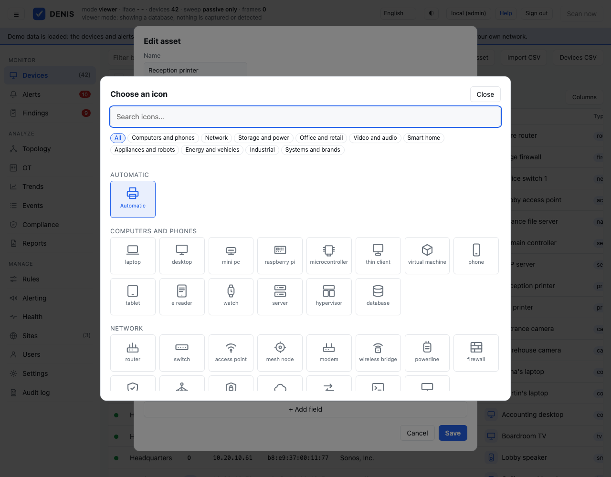

## Alerts

Things that changed, scored 0–100 (high ≥ 70, medium ≥ 50, low ≥ 30; below the minimum score an event is only
logged). Click an alert for the full story:

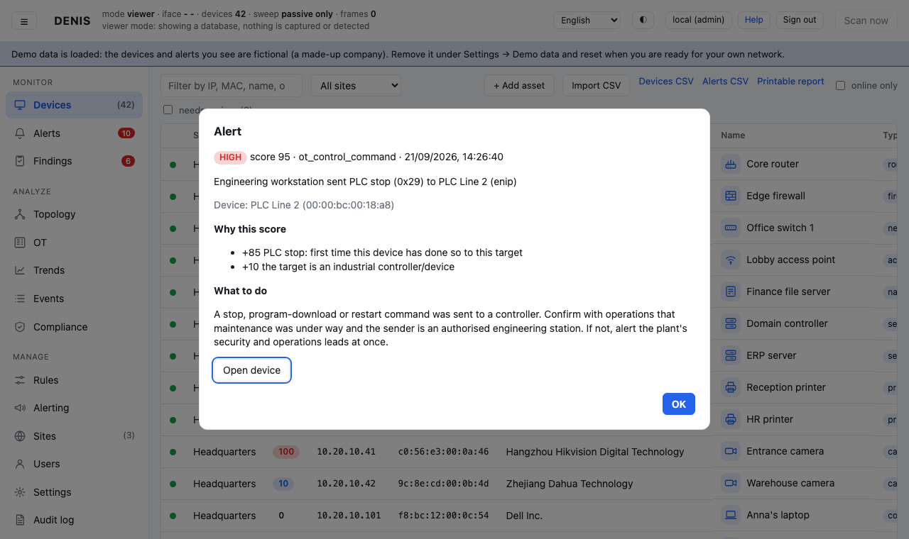

*what happened*, *why it scored what it did*, and **what to do next**. **Acknowledge** an alert when it is handled;
acknowledged alerts no longer count towards a device's risk score.

## Findings

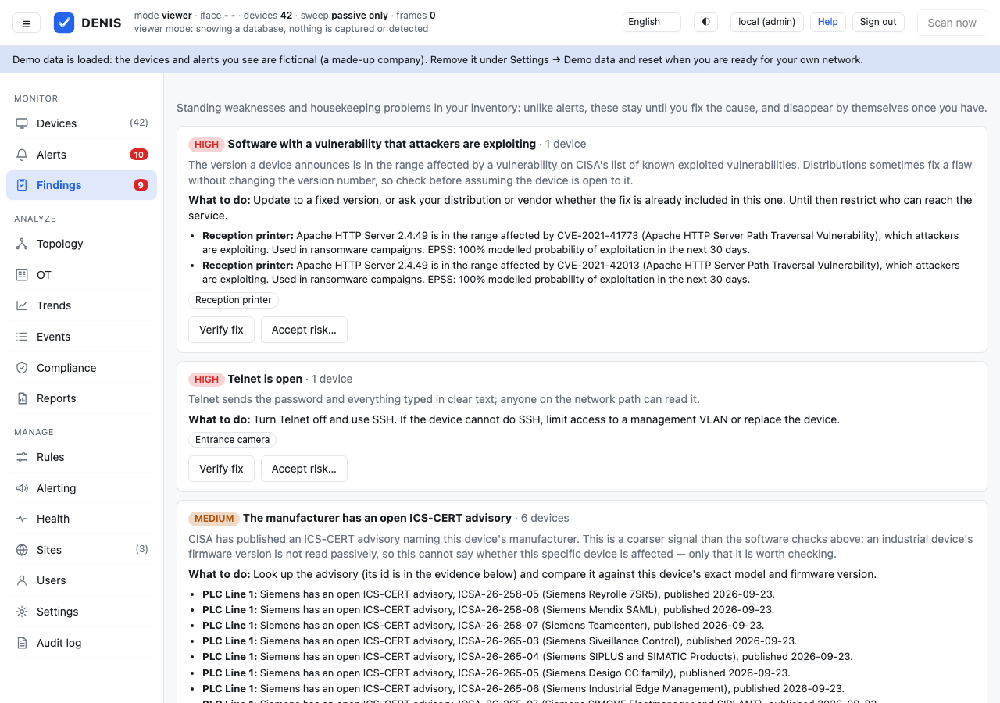

Standing weaknesses and housekeeping problems that stay until you fix the cause: Telnet or RDP open, a device
marked *lost* still on the network, critical devices with no owner, devices nobody has reviewed, expiring
warranties. Devices with the same problem are grouped, each with why it matters and what to do
([list](detection-rules.md#findings-standing-problems-with-a-fix)).

Each finding has two buttons. **Verify fix** looks again: DENIS scans the devices right now and tells you, device by
device, whether the problem is gone. **Accept risk…** (administrators) records a decision to live with it, with a
reason and, usually, an end date; the device leaves the finding and appears under **Accepted risks** below, with who
accepted it and why ([details](detection-rules.md#verifying-a-fix-and-accepting-a-risk)).

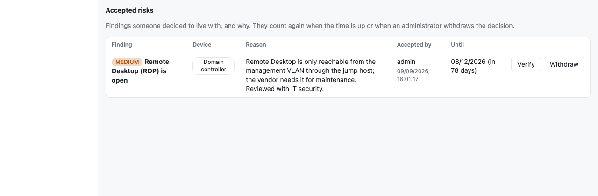

## Rules

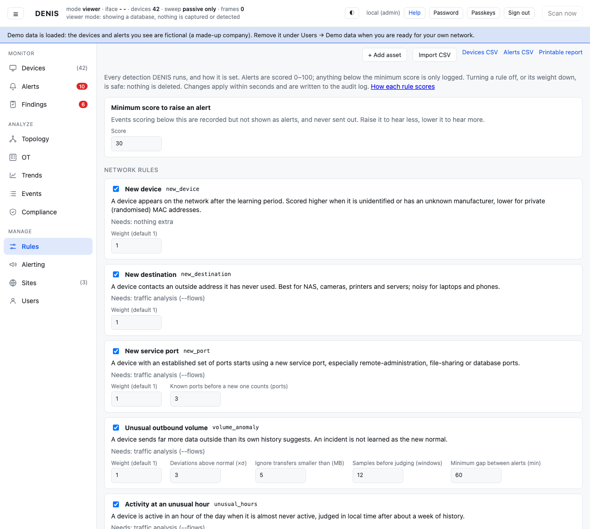

Every detection with what it does, what it needs, whether it is on, its weight (`0` = off, `2` = twice as loud)
its thresholds and a minimum score of its own, plus **exceptions** (devices, device types, tags or networks a rule
stays quiet about), your own **network watches** (which devices may talk to which addresses and ports) and your own
**OT command watches**. Everyone can read it; administrators change it. Changes apply
within seconds, survive restarts and are written to the audit log ([details](detection-rules.md)).

## Compliance

How complete your register is (reviewed, typed, owned, rated, Purdue levels) and how DENIS's capabilities line up
with controls of **CIS Controls v8**, **NIST CSF 2.0**, **IEC 62443-3-3**, **NIST SP 800-82** (through its NIST
SP 800-53 controls), **ISO/IEC 27001:2022 Annex A** and **NIS2 Article 21**: which are in place, partly or not yet,
and why. It is evidence for your own assessment, not a certification. Print the page to keep it.

## Topology

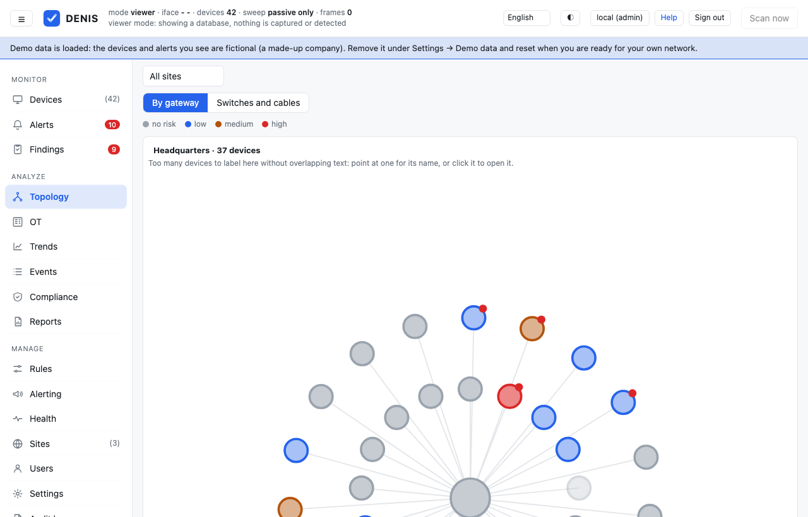

Devices grouped by type around the gateway; colour shows risk. Hover a device for its name, address and score.

## OT

For industrial networks ([OT guide](ot-guide.md)): industrial devices with their Purdue level, zone and the
protocols they speak (S = answers requests, C = sends them), the **communications matrix** (who talks to whom over
Modbus, S7, EtherNet/IP, DNP3, BACnet, OPC UA, IEC 104, with counts of reads, writes and control commands), and
the functions each path uses (**Commands seen**: click one to be told whenever it is sent) and the open OT alerts.
Filter to *writes / control commands only* to see who can change a process.

## Trends

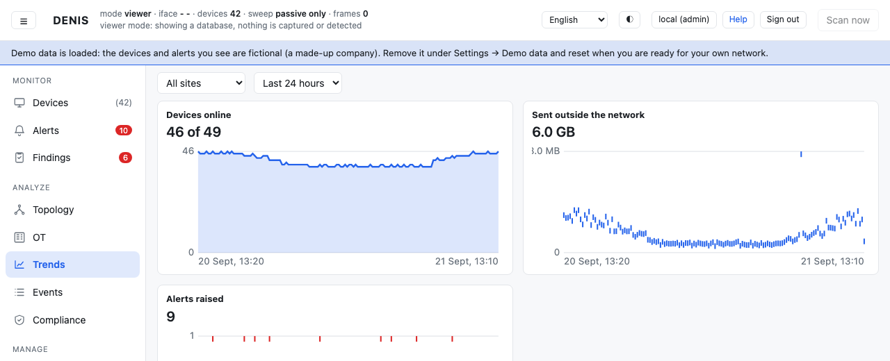

Devices online, traffic sent outside the network and alerts raised over the last hours or days, per site.
(Traffic needs `--flows`.)

## Events

Every event, including the low-scoring ones that never became alerts. Useful when you wonder *"did it notice
that?"*. Click a row for the full story.

## Health

The **Health** page (Manage) answers "is DENIS itself in good shape?". Problems come first, in plain words: the
capture is not running, packets are being dropped (DENIS too slow for the traffic, or a mirror port carrying more than
one machine can process), a network sweep is late, the disk holding the database is nearly full, or there is no
recent backup. The menu shows how many problems there are. Below: version and uptime, database size (and how much
of it is free space), free disk, packets dropped, the last sweep, and how many rows each table holds (what to look at
when the database is bigger than expected).

Administrators also see **Backups**: a daily automatic backup of the database (keep the newest 7, or change or switch
it off), *Back up now*, and a list to **download** or delete. See [Operations](operations.md#backup-and-restore).

## Sites

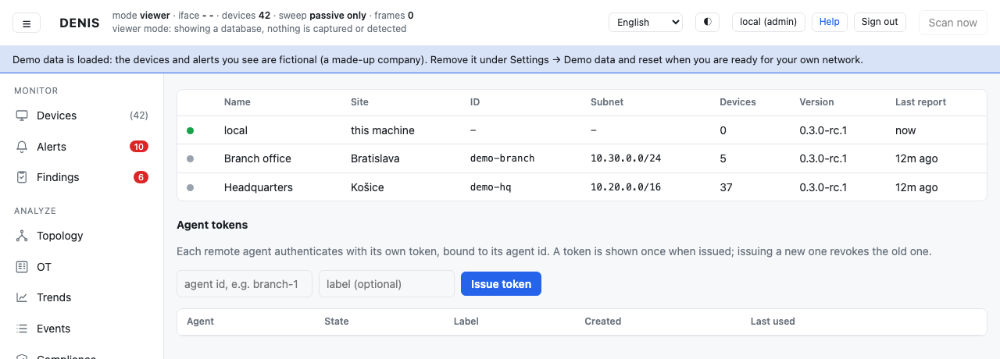

The local collector and every remote **agent** that reports to this master (outbound connections only). An
administrator issues and revokes one **token per agent** here. See [Deployment](deployment.md#multiple-sites-agents).

## Alerting (administrators)

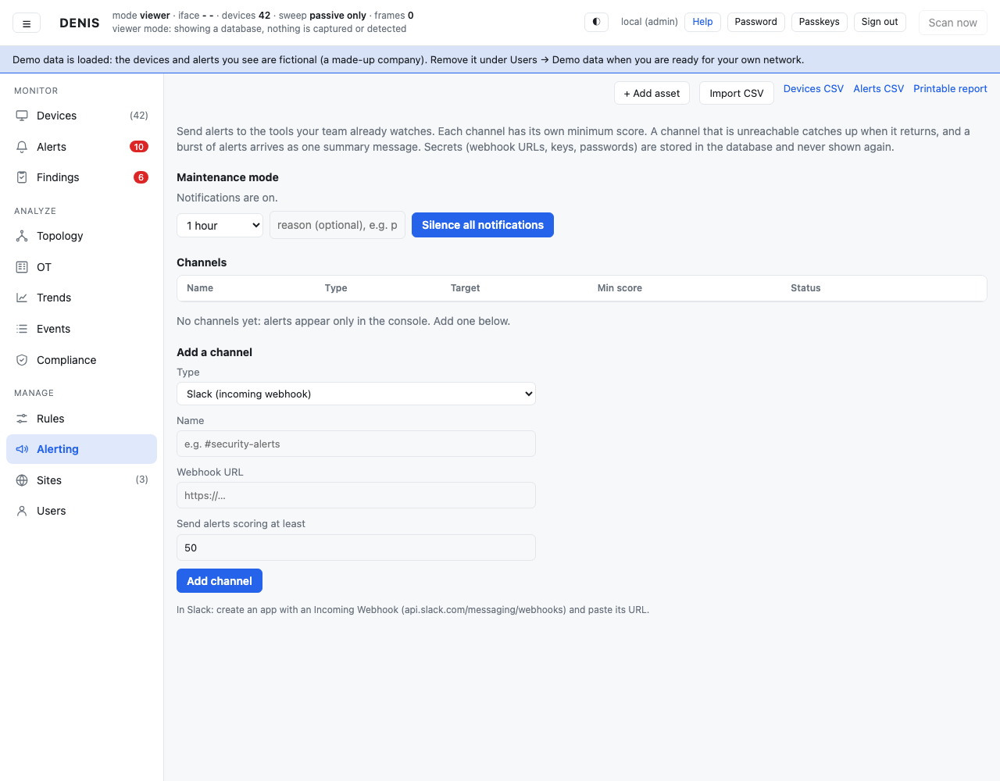

Where alerts go outside the console: Slack, Microsoft Teams, Discord, PagerDuty, e-mail and a signed webhook, each
with its own minimum score, a **Test** button and live delivery status. **Maintenance mode** silences everything for
30 minutes to 7 days ([details](alerting.md)).

## Users (administrators)

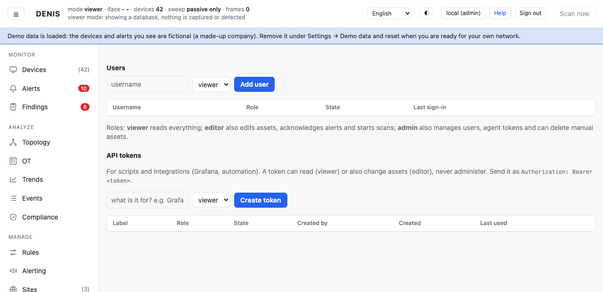

Accounts and roles (*viewer* reads, *editor* also edits devices and acknowledges alerts, *admin* also manages
users, settings and rules) and **API tokens** for scripts and Grafana.

## Settings (administrators)

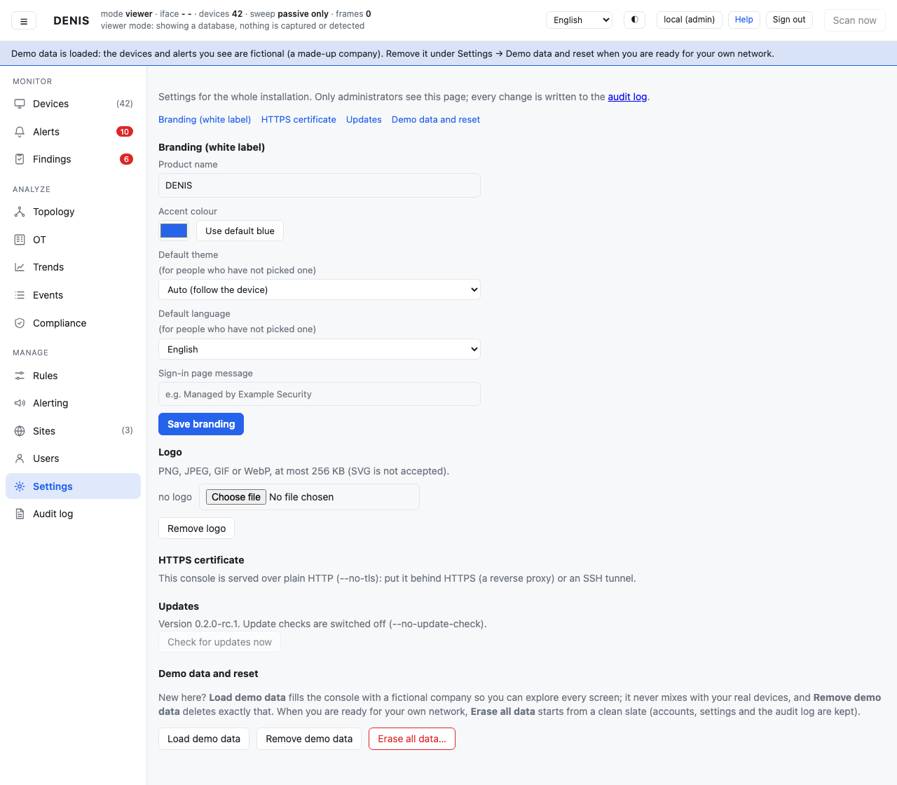

Everything about the installation that is not about people: **branding** (name, logo, colour, default theme and
language), the **HTTPS certificate** (download the local CA, or use your own), **updates** (check, install now or
later) and **demo data**: load a fictional company to explore, remove it, or **erase all data** when you are ready for
the real network ([details](operations.md#demo-data-and-starting-clean-erase-all-data)).

## Audit log (administrators)

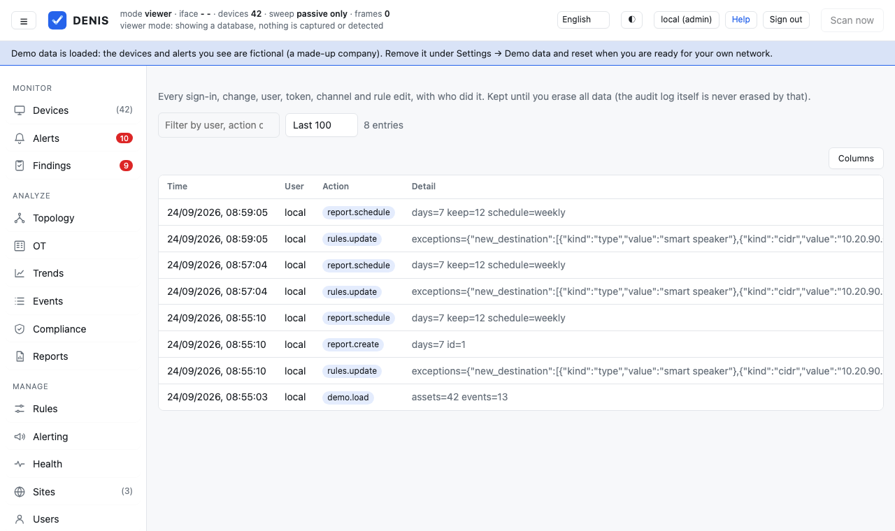

Every sign-in, change, user, token, channel and rule edit with who did it, filterable, the last 100 to 1000 entries.

## My account

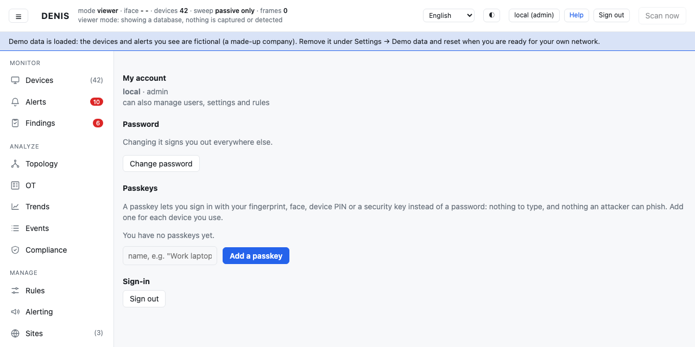

Click your name in the header. Here you change your **password** and manage your **passkeys**: sign in with a
fingerprint, face, device PIN or security key instead of a password, one per device ([details](security.md#passkeys)).

## Reports

The **Reports** page (Analyze) keeps snapshots of your network on the DENIS server. A report is a self-contained
page: summary, compliance overview, findings, accepted risks, trends, devices by risk, alerts and lifecycle. It
carries your branding. **Open** it, **Download** it as one HTML file, or print it (or save it as PDF) to hand to a
client or an auditor.

* **Make a report now** (editors and administrators) for the last 7 days up to a year. The report is stored, so
  last month's is still there next month, exactly as it was.
* **Schedule** (administrators): every week or every month, covering a period you choose. DENIS keeps the newest
  N scheduled reports and removes older ones; reports you made by hand are never removed. Deleting a report is an
  administrator's action and goes to the audit log.
* Reports are kept in DENIS's database, so they are included in backups, and **Erase all data** removes them too.

`/report?days=7` still gives a live report that is not saved (see the [API](api.md)).
