# The console, tab by tab

Everything DENIS shows or does, in the order you will meet it. Tabs an administrator only sees are marked.
Addresses like `#rules` or `#device/12` can be bookmarked or pasted into a message.

## MSP view (optional)

Off by default. An administrator turns it on under **Settings → Branding & MSP → MSP view** for installs that
manage more than a couple of sites — an MSP with several customers, or one business with several
branches. One row per site (the local network and every remote agent you can see, respecting your
own site access): online status, device count, open alerts by severity, last report time. Click a
row to open that site's devices.

## Header

Product name and logo (yours, see [Branding](branding.md)), a status pill (a dot plus "sweep 3m ago" or
"sweeping…", with an "export ok" / "export FAILING" chip when an export is configured; hover it for the full
sentence — mode, network, devices, last sweep, health of exports — also shown on the [Health](#health) page),
the **language** picker, the **colour theme** button (auto / day / night), your name (click it for [My account](#my-account)),
**Help** (this documentation), **Sign out** and **Scan now** (an immediate sweep and port scan; disabled in passive-only mode).
**Ask DENIS** appears next to *Scan now* when that AI feature is on ([Settings → AI](#settings-administrators)): a
floating question box that stays open while you move between pages. It does five things, each answered from DENIS's
own real data or real documentation — never from what the model already "knows" about networks in general:

* **Search recent alerts.** *"Any high-severity alerts today?"*, *"new destinations from the finance VLAN this
  week"* — a plain-language stand-in for the Alerts page's own filters.
* **Hunt for a destination across every device's history.** *"Has anything ever talked to 203.0.113.9?"*, *"which
  devices have contacted 10.0.5.0/24?"* — searches every device's own learned baseline and its recorded
  [relationships](concepts.md#relationships-and-the-investigate-section), not just recent alerts. An exact IP
  address or a CIDR range only: DENIS does not keep which domain names a device looked up.
* **Navigate.** *"Take me to Topology"*, *"open the SSO settings"*, *"show me the OT devices"* — jumps straight
  there, the same as typing the address, with nothing to read afterwards.
* **Answer how-to and configuration questions** from this very documentation. *"How do I add a switch?"*, *"how do
  I set up single sign-on?"* — answered from the one real page that covers it, never guessed.
* **Say what it can do**, truthfully and from this installation's own feature toggles: *"what can you do?"* lists
  exactly the five things above plus whichever on-click AI features (assessment, behavior explanations, incident
  consequences…) are actually switched on for you, never more.

It never changes a setting, acknowledges an alert, or takes any action by itself — only looks things up, navigates,
or describes what is really there. A yellow banner appears while **maintenance mode** silences notifications; a blue
one while demo data is loaded or an update is available.

The menu on the left is grouped into *Monitor* (Devices, Incidents, Alerts, Findings), *Analyze* (Topology, OT,
Software, Events, Compliance, Reports) and *Manage* (Rules, Alerting, Health, Sites, Users, Settings, Audit log);
the ☰ button collapses it to an icon rail.

## Dashboard

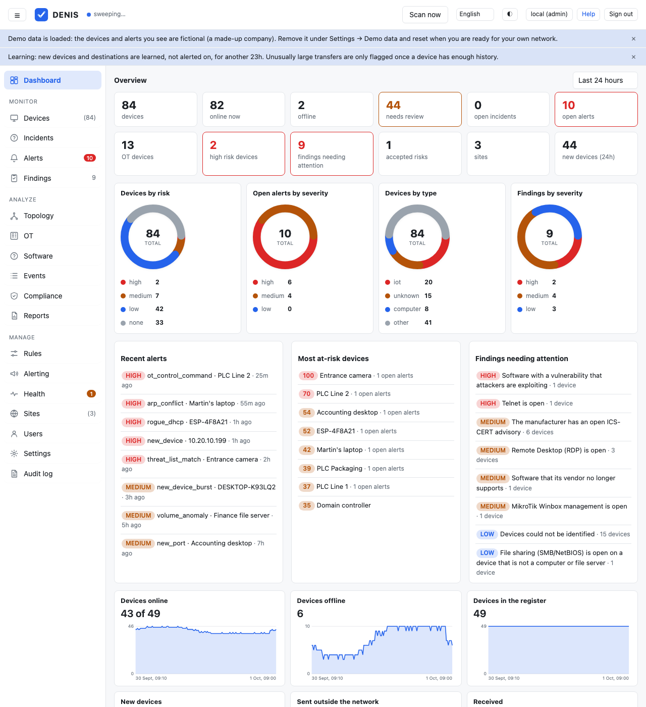

The home screen, and the first thing you see after signing in — and, since the standalone Trends page was folded
into it, the one screen that answers both "what needs attention right now" and "what has this network been doing".
With an AI provider configured and **Settings → AI → Dashboard AI summary** on, an **AI Security Summary** card sits
at the very top: a short, plain-language read of recent alert activity, written only when it actually changes (not on
every page load), never what drives alerting itself.

Below that: twelve at-a-glance counts (devices, online/offline, needs review, open alerts, high-severity alerts, OT
devices, high-risk devices, findings needing attention, accepted risks, sites, new devices in the chosen period) —
click any of them to jump straight to the filtered list behind it — and four donut breakdowns (devices by risk, open
alerts by severity, devices by type, findings by severity — click a segment or its legend entry to drill into exactly
what it shows). Next, **Top exposures today**: the devices with a serious standing fact (a known-exploited or
critical vulnerability, unsupported software, an open incident, a high-severity finding), ranked, each with every
point listed and where it comes from — the top five, and **Show all** for the rest ([how it is ranked](concepts.md#top-exposures-today)).
Then three lists of what actually needs a look right now: recent alerts, the most at-risk devices, and standing
findings.

The rest of the page is the former Trends page, over the same period you pick at the top (24 hours / 7 days / 30
days): eight charts — devices online, devices offline, devices in the register, new devices, traffic sent outside the
network, traffic received, total traffic, and alerts raised (traffic needs `--flows`) — followed by **Top talkers**:
which devices have sent and received the most, from each device's own traffic baseline. Unlike the charts above it,
this is a live leaderboard, not a period (a device seen longer naturally shows more; hover a bar for that device's
own start). The gateway and this monitoring host are left out automatically, since traffic naturally funnels through
them; click **×** on any device to hide it from all three lists too.

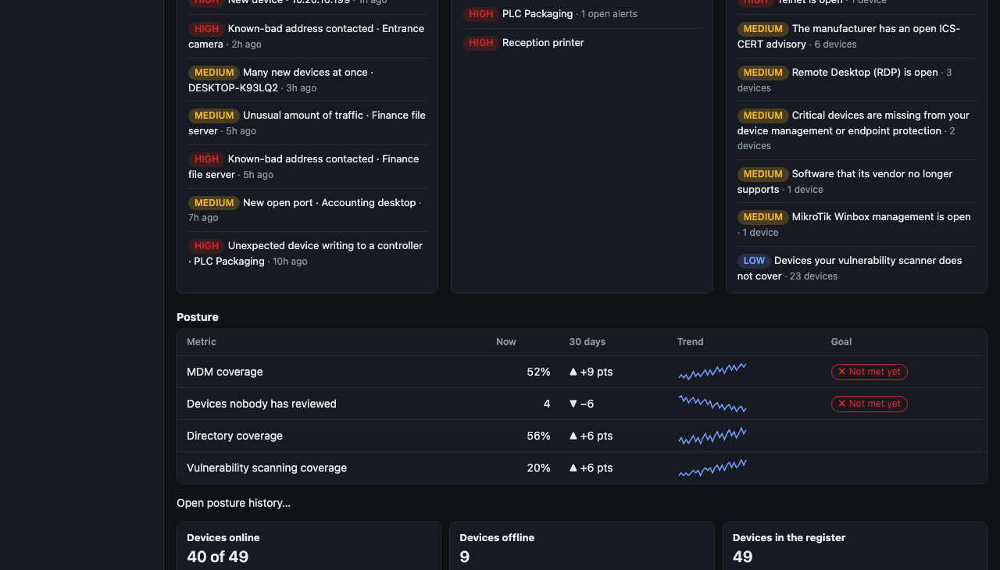

Every number on this page is drawn from state the console already has, so opening it costs nothing extra beyond its
own trend-chart request. Every other tab is unchanged and still one click away in the sidebar.

## Tables: columns

Every table with four or more columns has a **Columns** button above it. **Tick** the columns you want to see,
**move** them with the arrows (or by dragging a heading onto another), and **resize** one by dragging the right edge
of its heading (double-click the edge to give it back its natural width). **Reset columns** puts everything back.
Your choice is kept **in this browser only**, per table: it does not change what anyone else sees, and clearing the
browser's site data resets it. Sorting by a heading works as before, and the layout stays while the lists update.

## Devices

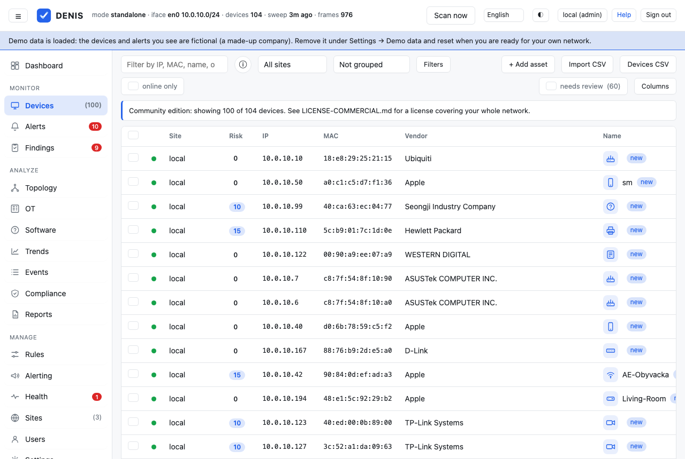

Every device found. Columns: online dot, risk score, IP, MAC, manufacturer, name (with its icon), type, location
(location), guessed OS, open ports, last seen. Click a header to sort; type in the filter box to search IPs, MACs,
names, owners, serial numbers, tags and more.

* **Group by** (type, location or owner) breaks the list into sections, each with its own count; a device with nothing
  entered for the field falls into an "unset" group at the end. Sorting still works inside each group.
* **Filters** combines several conditions at once (type **and** location **and** vendor **and** owner **and** a
  substring of the OS guess) — a badge on the button shows how many are set; **Clear filters** resets them.
* **online only** hides silent devices; **needs review** shows the [review queue](asset-management.md#the-review-queue).
* **Devices CSV** and **Import CSV** are buttons next to each other; **+ Add asset** adds one by hand.

Group-by and filters are per-browser, like table columns; they narrow what is shown, not what is exported (**Devices
CSV** always exports every device).

The **risk score** (0–100) is explained factor by factor on the device page: exposed services (Telnet, RDP…),
how well the device is identified, and its open alerts. Devices you rate *critical* weigh more.

### A device

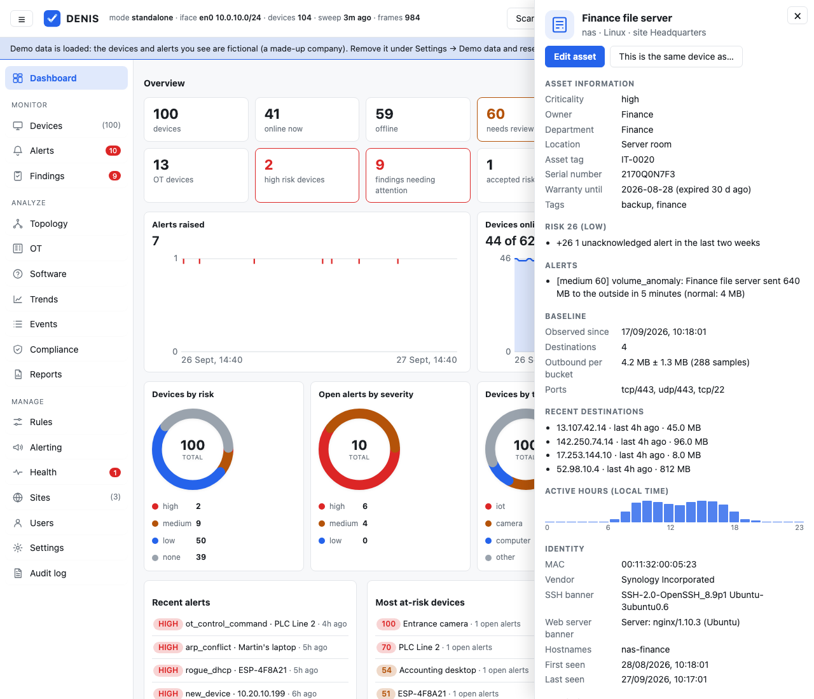

Everything DENIS knows: your data (owner, serial number, warranty…), what it *discovered* and the **evidence
behind each guess** ("Why this guess"), IP history, open ports, the learned **traffic baseline** (usual
destinations, ports, volume, active hours), its alerts and the **change history** of your edits. A device on the
Dashboard's Top exposures list also gets a **Why this is a top exposure** section on its Overview, line by line.

### Editing a device

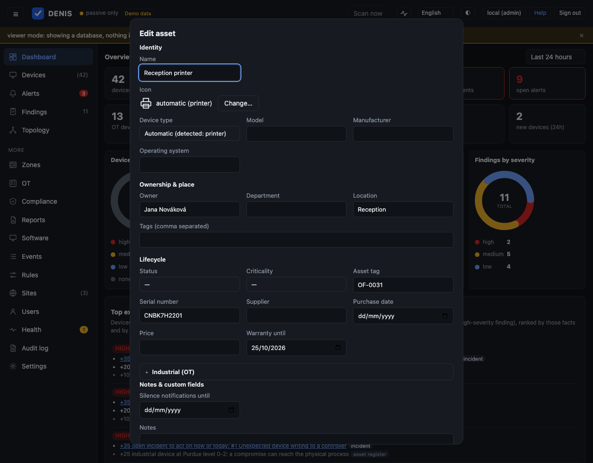

Name, icon, device type, status, criticality, owner, department, location, zone, Purdue level, asset tag, serial
number, model, supplier, purchase and warranty dates, tags and your own custom fields. **Silence notifications
until** stops chat/e-mail alerts about this one device until a date (for a test bench or planned work); alerts still
show in the console. Saving marks the device as reviewed. Discovery never overwrites what you typed.

The icon row shows the current icon with **Change…** right beside it; that opens a window with all 120+ icons grouped by kind and a search box, and **Automatic** lets DENIS choose from the device type. Picking an icon sets the matching device type; the device type is a list (first entry: *Automatic (detected: …)*).

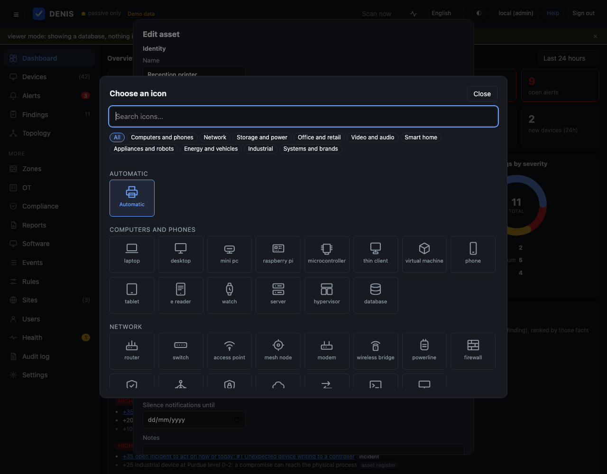

## Incidents

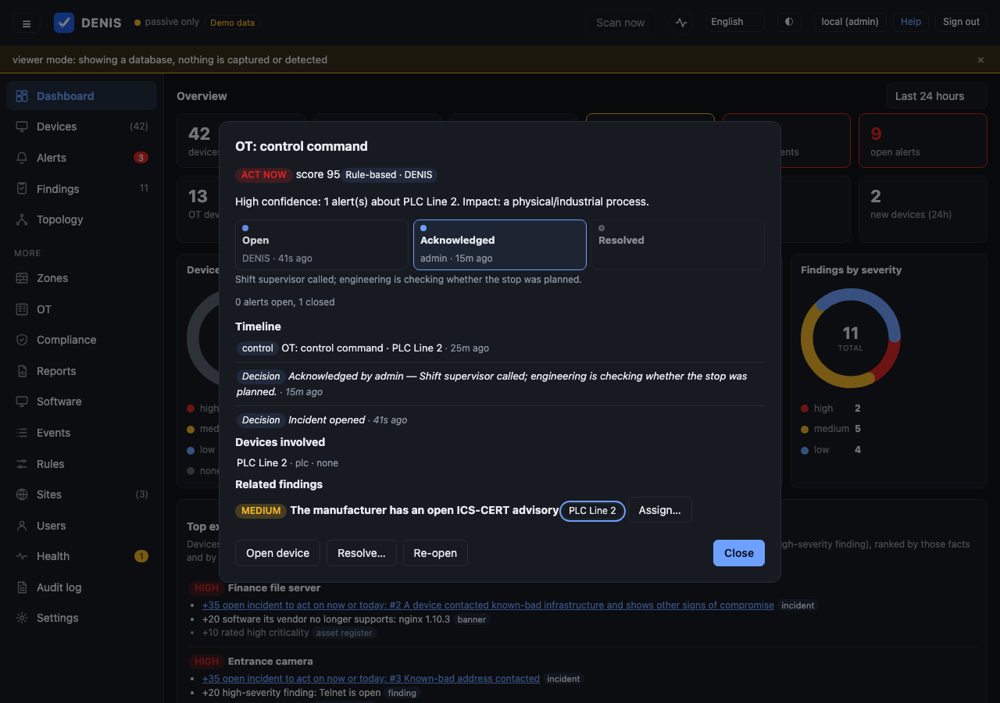

Related alerts grouped into one incident with its own priority (*Act now* / *Investigate today* / *Review* / *Can
wait*), so a device going through several stages of trouble is one row to work instead of several scattered across
the Alerts page. An alert that stays on its own just stays on Alerts — incidents never hide or replace anything
there. Click one for its timeline, the devices involved, the findings on those devices, and, with an AI provider
configured, **Assess consequences with AI**. An incident is worked in three steps (*Open*, *Acknowledged*, *Resolved*),
each recorded with who and when; **Resolve…** needs a reason, and nothing you do to an incident ever closes a finding.
Full details, including what triggers grouping and how incidents reach your notification channels, in
[Incidents](incidents.md).

## Alerts

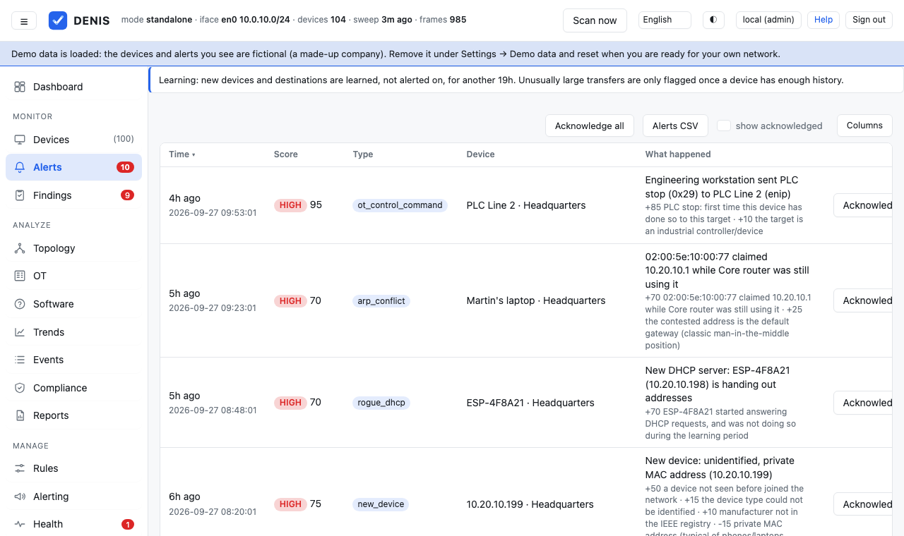

Things that changed, scored 0–100 (high ≥ 70, medium ≥ 50, low ≥ 30; below the minimum score an event is only
logged). Click an alert for the full story:

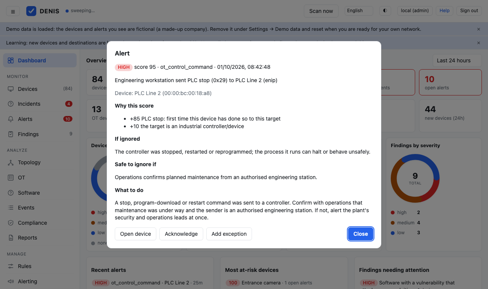

*what happened*, *why it scored what it did*, and **what to do next**. **Acknowledge** an alert when it is handled,
with an optional reason (resolved / false positive / expected behaviour); acknowledged alerts no longer count
towards a device's risk score. Tick several rows to acknowledge them together, or **Acknowledge all**. The same
alert kind repeating for the same device is folded into one row ("×12, recurring since…") that expands on click.
**Add exception** (administrators) silences that exact alert for that device without a trip to the Rules page.
With an AI provider configured, **Assess & Explain with AI** appears in the dialog: one click covers what the
alert means, whether it looks malicious, the consequences of ignoring it and what to do next, plus — for alerts
about a change from a device's own baseline — a behavior-change explanation, all in the same answer.
**Alerts CSV** (a button, next to *show acknowledged*) exports the list.

**Investigate**, a collapsible section in the same dialog, shows the alert in context: the device's other events an
hour either side, what DENIS recorded between the device and the alert's other party, which other devices contacted
that same party, and the incident it belongs to. Traffic between two of your own devices only shows up there with
east-west traffic switched on (Settings → Network interfaces; off by default). See
[Relationships](concepts.md#relationships-and-the-investigate-section).

Any public IP address the alert mentions gets its own **Network context** section: the address, its country/ASN/ISP
(or "private"/"loopback"/etc. for one that is not public), reverse-DNS hostname, and — click it — a full detail
panel with coordinates, connection type and which GeoIP database answered. See
[IP enrichment](#ip-enrichment) below for where this data comes from and how to configure it. The same section
appears on the Events page (identical dialog) and, for an address's history, on a device's own panel.

## Findings

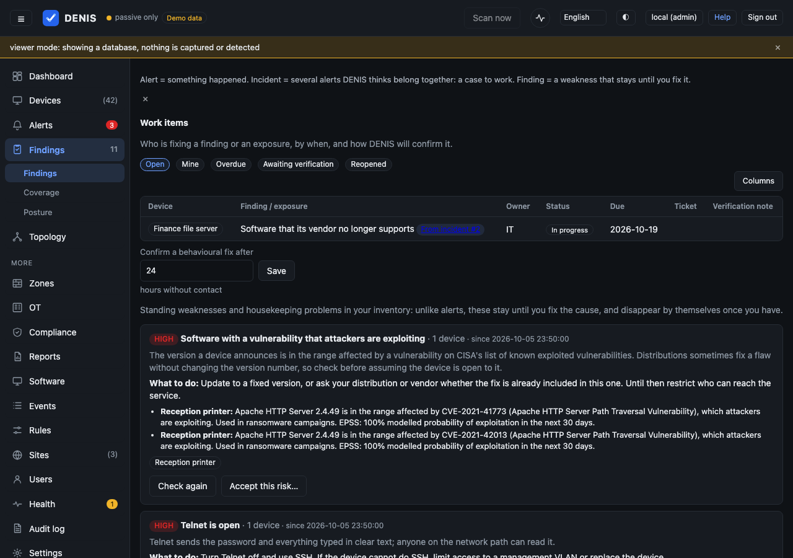

Standing weaknesses and housekeeping problems that stay until you fix the cause: Telnet or RDP open, a device
marked *lost* still on the network, critical devices with no owner, devices nobody has reviewed, expiring
warranties. Devices with the same problem are grouped, each with why it matters and what to do
([list](detection-rules.md#findings-standing-problems-with-a-fix)).

Findings about software versions (support ended, a known-exploited range) list, per device, the product, the version that
was read from its banner and what it means ([details](detection-rules.md#software-versions-end-of-support-and-known-exploits)).

Each finding has two buttons. **Verify fix** looks again: DENIS scans the devices right now and tells you, device by
device, whether the problem is gone. **Accept risk…** (administrators) records a decision to live with it, with a
reason and, usually, an end date; the device leaves the finding and appears under **Accepted risks** below, with who
accepted it and why ([details](detection-rules.md#verifying-a-fix-and-accepting-a-risk)).

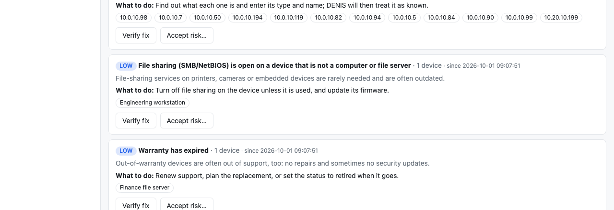

## Rules

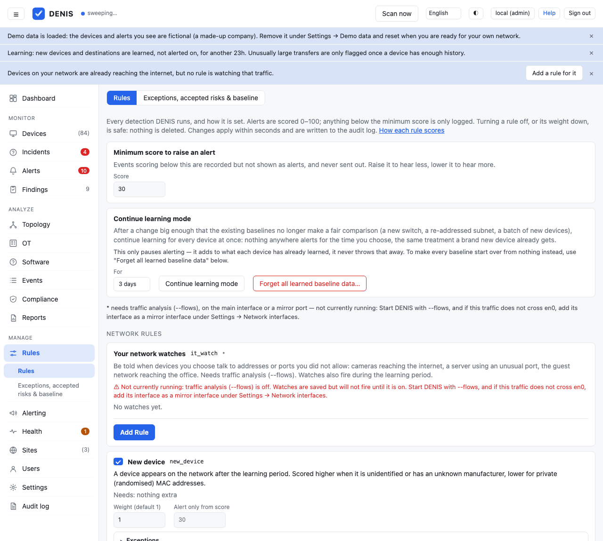

Every detection with what it does, what it needs, whether it is on, its weight (`0` = off, `2` = twice as loud)
its thresholds and a minimum score of its own, plus **exceptions** (devices, device types, tags or networks a rule
stays quiet about), your own **network watches** (which devices may talk to which addresses and ports) and your own
**OT command watches**. Everyone can read it; administrators change it. Changes apply
within seconds, survive restarts and are written to the audit log ([details](detection-rules.md)). Administrators
also find **Continue learning mode** and **Forget all learned baseline data** here, and can export the rule
settings as a file and import them elsewhere.

The page has a second view, **Exceptions, accepted risks & baseline** (a sub-entry in the menu): every place a
rule, watch or finding has been told to stay quiet, and every learned baseline destination, grouped by device in
one searchable list. Removing something here has exactly the same effect as removing it where it was added.

## Compliance

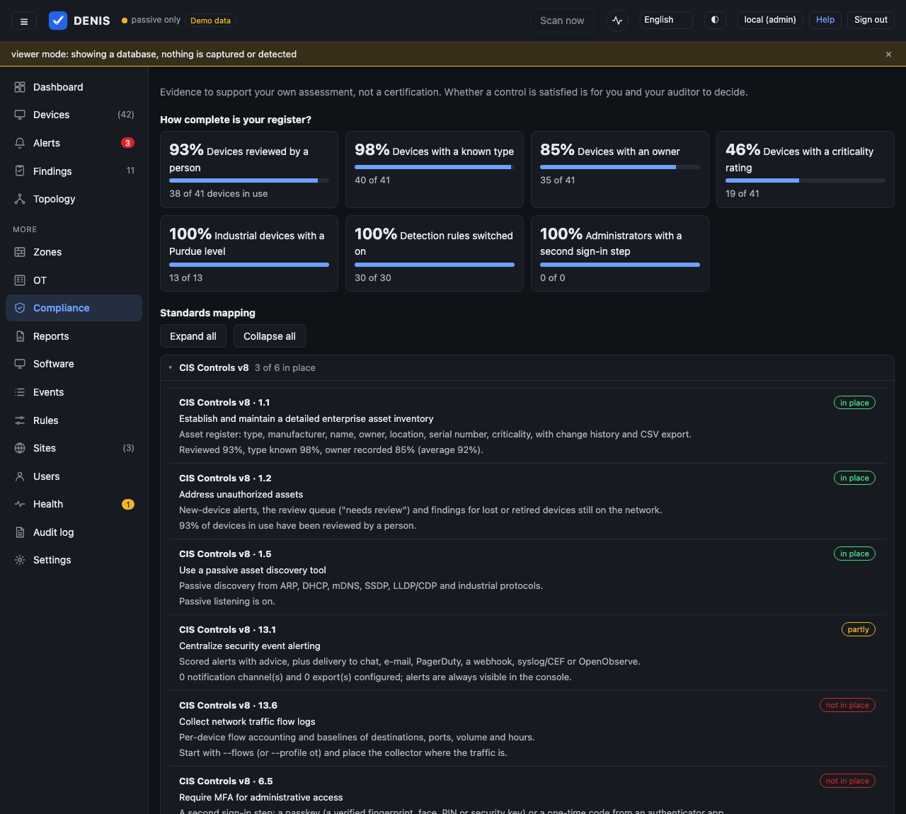

How complete your register is (reviewed, typed, owned, rated, Purdue levels) and how DENIS's capabilities line up
with controls of **CIS Controls v8**, **NIST CSF 2.0**, **IEC 62443-3-3**, **NIST SP 800-82** (through its NIST
SP 800-53 controls), **ISO/IEC 27001:2022 Annex A**, **NIS2 Article 21**, **DORA**, **PCI DSS v4.0**, the
**HIPAA Security Rule**, **SOC 2** (Trust Services Criteria) and **CMMC 2.0** (through NIST SP 800-171): which are
in place, partly or not yet, and why. It is evidence for your own assessment, not a certification. Print the page
to keep it.

## Topology

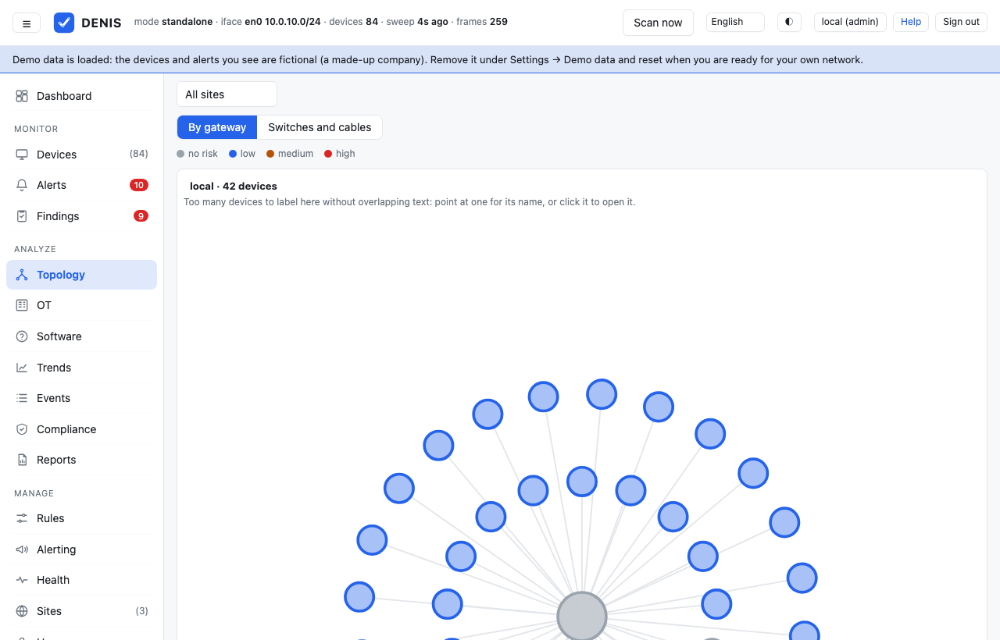

Devices grouped by type around the gateway, each one an icon chip coloured by its risk level (see the legend above
the map). Click a chip to select it: every other node and spoke dims and the selected device's own spoke to the
gateway is highlighted, so a crowded map stays readable; click the same chip again (or its already-selected self) to
open that device's own page. Hover any chip for its name, address, type and risk score. A device with an unacknowledged
alert raised in the last five minutes gets a pulsing ring around it, so something that just happened stands out
without having to scan every number.

**Switches and cables** is the physical map, read from your switches over SNMP: which port each device is plugged into and
how the switches are cabled together. A device's panel gets a *Connected to* line. Set it up under *Settings* → *Switches (SNMP)*
([details](switches.md)).

## OT

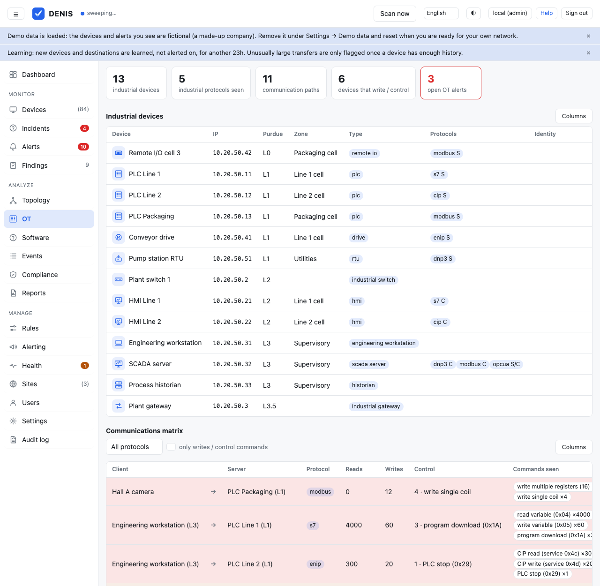

For industrial networks ([OT guide](ot-guide.md)): industrial devices with their Purdue level, zone and the
protocols they speak (S = answers requests, C = sends them), the **communications matrix** (who talks to whom over
Modbus, S7, EtherNet/IP, DNP3, BACnet, OPC UA, IEC 104, with counts of reads, writes and control commands), and
the functions each path uses (**Commands seen**: click one to be told whenever it is sent) and the open OT alerts.
Filter to *writes / control commands only* to see who can change a process.

## Software

Every product and version DENIS has read from a service banner (SSH, HTTP, FTP, SMTP, MySQL/MariaDB), grouped by
software instead of by device, with a status per row: known-exploited, end of support, end of support soon, or
no known issue — the same data the Findings page checks, seen fleet-wide. Click a device count to see which
devices run that version.

## Events

Every event, including the low-scoring ones that never became alerts. Useful when you wonder *"did it notice
that?"*. Click a row for the full story.

## Health

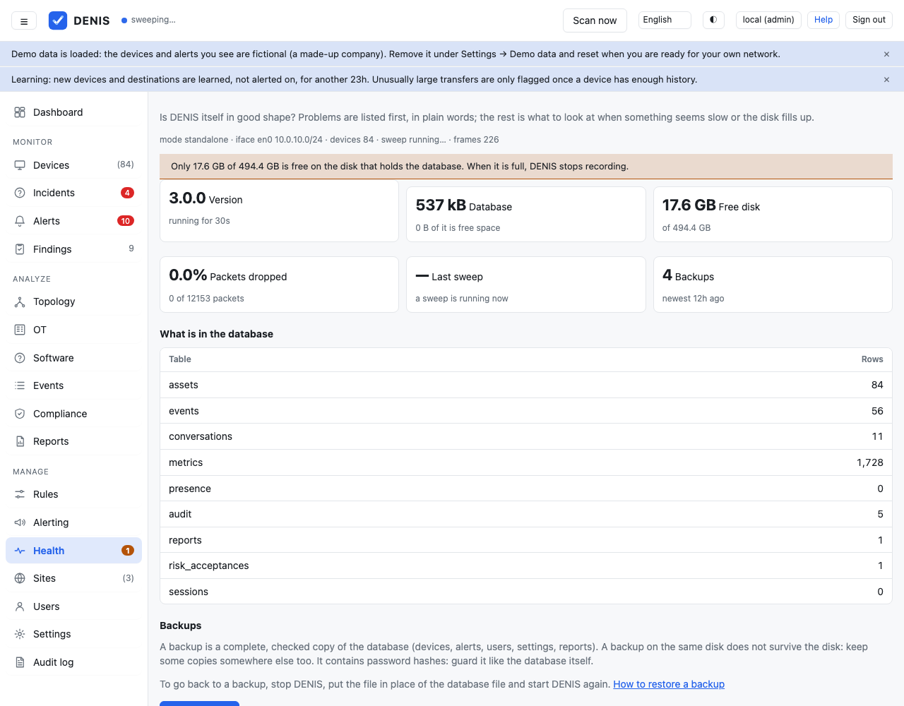

The **Health** page (Manage) answers "is DENIS itself in good shape?". Problems come first, in plain words: the
capture is not running, packets are being dropped (DENIS too slow for the traffic, or a mirror port carrying more than
one machine can process), a network sweep is late, the disk holding the database is nearly full, or there is no
recent backup. The menu shows how many problems there are. Below: version and uptime, database size (and how much
of it is free space), free disk, packets dropped, the last sweep, and how many rows each table holds (what to look at
when the database is bigger than expected).

Administrators also see **Backups**: a daily automatic backup of the database (keep the newest 7, or change or switch
it off), *Back up now*, and a list to **download** or delete. See [Operations](operations.md#backup-and-restore).

## Sites

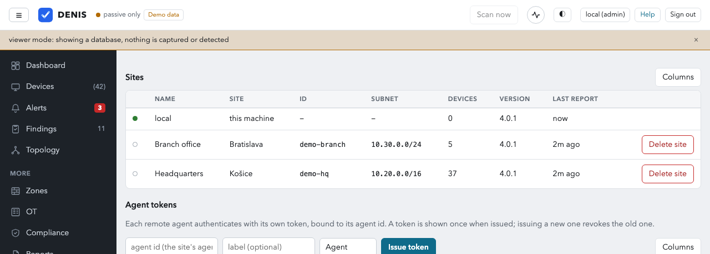

The local collector and every remote **agent** that reports to this master (outbound connections only). An
administrator issues and revokes one **token per agent** here, and can **delete a site** together with every
device it reported (the site id has to be typed back to confirm; the token is revoked separately). See
[Deployment](deployment.md#multiple-sites-agents).

## Alerting (administrators)

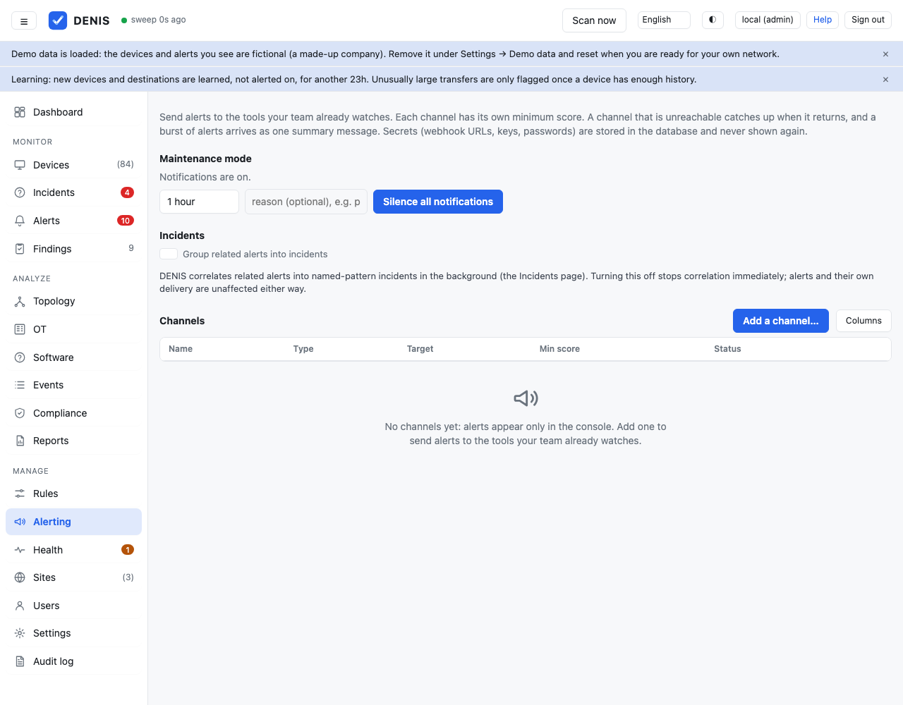

Where alerts go outside the console: Slack, Microsoft Teams, Discord, PagerDuty, Pushover, ntfy, e-mail, Jira, ServiceNow and a signed webhook, each
with its own minimum score, its own **Delivery** choice (every alert individually, or grouped into
[incidents](incidents.md#turning-it-off-and-sending-incidents-out)), a **Test** button and live delivery status.
**Maintenance mode** silences everything for 30 minutes to 7 days, and **Group related alerts into incidents** (on by
default) turns the correlation itself on or off network-wide ([details](alerting.md)).

## Users (administrators)

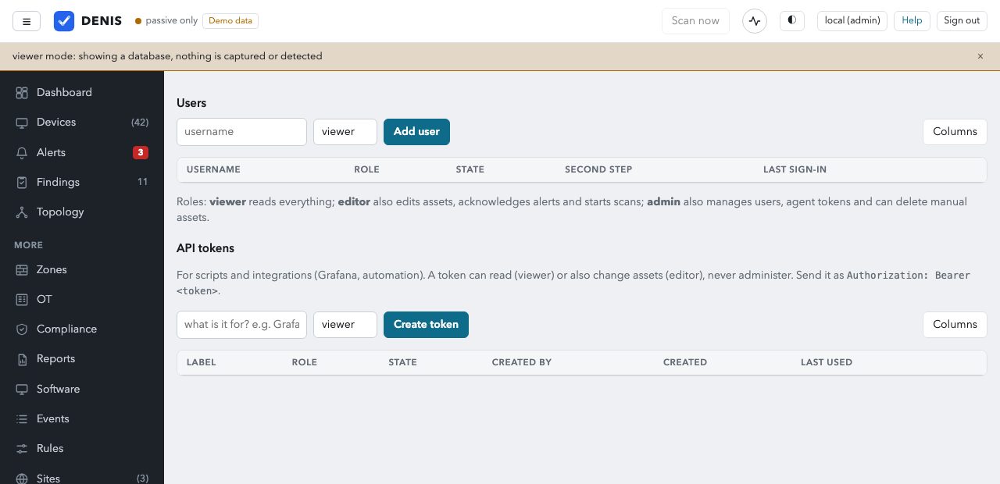

Accounts and roles (*viewer* reads, *editor* also edits devices and acknowledges alerts, *admin* also manages
users, settings and rules) and **API tokens** for scripts and Grafana.

**Sites** (per user) opens which sites — the local network, or a remote agent — that person may see or change:
**full access**, **read only**, or **no access**. Nothing is set by default, which means full access everywhere,
same as before this existed; an administrator restricts a user only by opening this and choosing otherwise.
Administrators themselves are never restricted. Useful for an MSP whose technicians should only see their own
customers, or to keep a sensitive site out of a viewer's sight entirely.

## Settings (administrators)

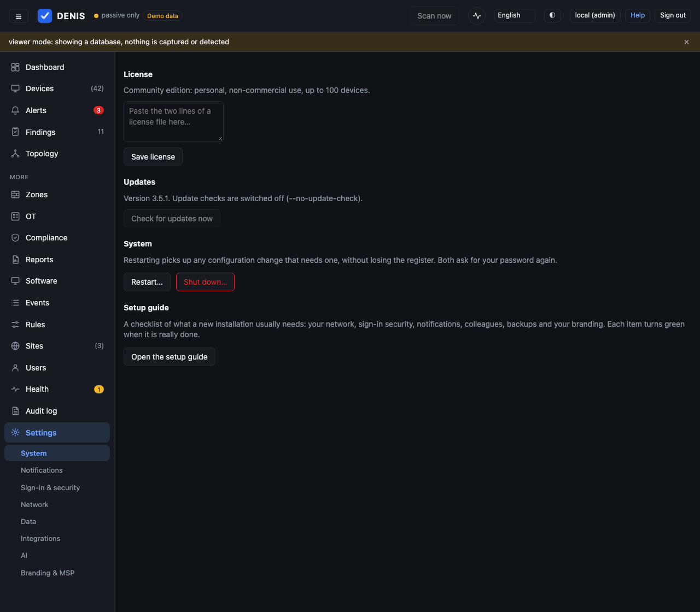

Everything about the installation that is not about people, in seven categories shown as a sub-menu under
*Settings*:

* **System** — license, updates (check, install now or later), restart / shut down, the setup guide (the first-run
  checklist, which you can open again here).
* **Sign-in & security** — who must use a second step, passkey-only sign-in, single sign-on (OIDC), the HTTPS
  certificate (download the local CA, or use your own).
* **Network** — the discovery and mirror interfaces and the agent listener, switches (SNMP), Network Intelligence
  (GeoIP / reverse DNS).
* **Data** — data retention, the software-version data (end-of-support and known-exploited refreshes, custom
  CVEs), threat list sources (the auto-fetched abuse.ch, Spamhaus and Tor exit blocklists, each independently schedulable), and
  demo data: load a fictional company to explore, remove it, or **erase all data** when you are ready
  for the real network ([details](operations.md#demo-data-and-starting-clean-erase-all-data)).
* **Integrations** — SIEM / log export, CMDB import (Entra ID, Intune, Active Directory, Jamf Pro, Azure, AWS,
  GCP), the vulnerability scanner (Nessus).
* **AI** — the optional bring-your-own-key AI features, each with its own switch, and their usage counters.
* **Branding & MSP** — name, logo, colour, default theme and language; the MSP view.

Deep links like `#settings/tls` still open the right category.

## IP enrichment

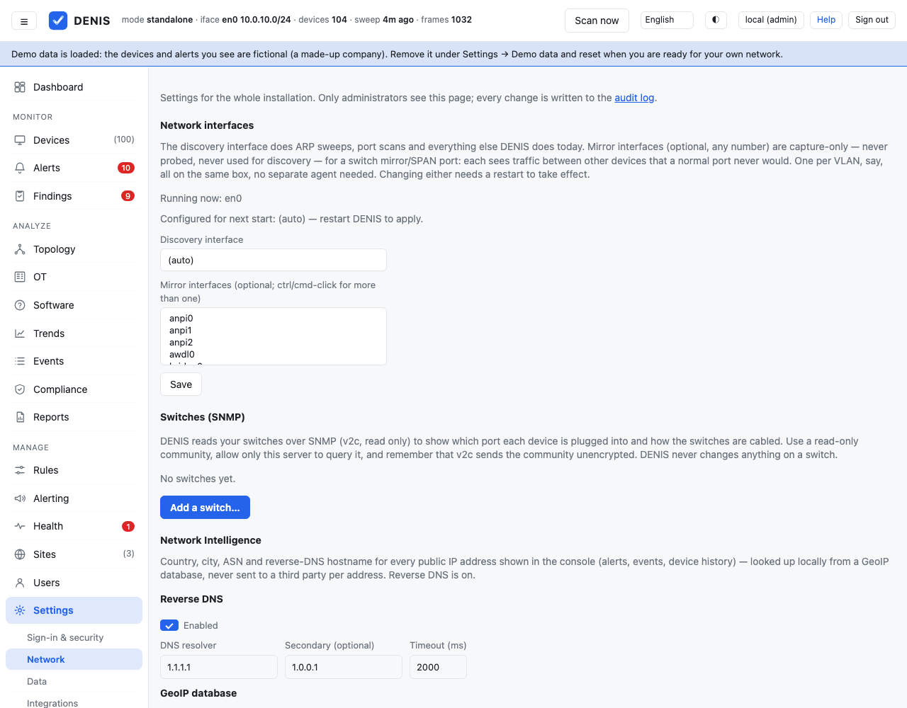

Every public IP address the console shows (Alerts, Events, a device's Recent destinations and IP history) gets a
flag, AS organisation, ASN and reverse-DNS hostname right next to it — no extra click needed. The flag comes first,
with the country's name as a hover tooltip rather than spelled out in text; the reverse-DNS hostname, usually the
longest part by far, sits on its own line underneath. A private/loopback/link-local/multicast/reserved address is
never geolocated at all, only classified as such. Clicking the address itself still opens a full detail panel with
coordinates, connection type and which GeoIP database answered.

Under *Settings* → **Network** → **Network Intelligence**:

* **Reverse DNS**: on by default (resolver `1.1.1.1`, secondary `1.0.0.1`, 2000 ms timeout) — change the
  resolver(s) and timeout, or switch it off entirely.
* **GeoIP database**: **DB-IP Lite** by default (free, [CC BY 4.0](https://db-ip.com)), or point it at your own
  MaxMind-format `.mmdb` file(s) if you have a licensed database — DENIS never distributes one for you.
  **Automatically update** is on by default (monthly) — DB-IP Lite downloads and installs its own current release
  on its own, so a fresh install never has to wait for someone to notice a manual button. Choose Daily/Weekly/
  Monthly, or turn it off for on-demand-only ("Update now"). The provider/version/last-updated date is shown live,
  and a Settings save takes effect immediately, no restart.
* **Cache**: GeoIP answers are kept for 30 days, reverse-DNS answers for 24 hours, by default — both adjustable.
  The same address is never looked up twice while its cached answer is still fresh, however many alerts mention it.
* Nothing about this ever slows down or blocks device discovery, alerting or event processing: enrichment happens
  in the background, and a page of alerts shows whatever is already known rather than waiting on a lookup.

## Users: second step and Sign-in & security

The *Users* page shows how each person signs in (authenticator app, passkeys), and **Reset** removes somebody's
authenticator app after a lost phone. Under *Settings* → **Sign-in & security** an administrator can require a second
step for administrators or for everybody, and, separately, require a **passkey only** (once a covered person has
added one, their password no longer opens a session).

## Audit log (administrators)

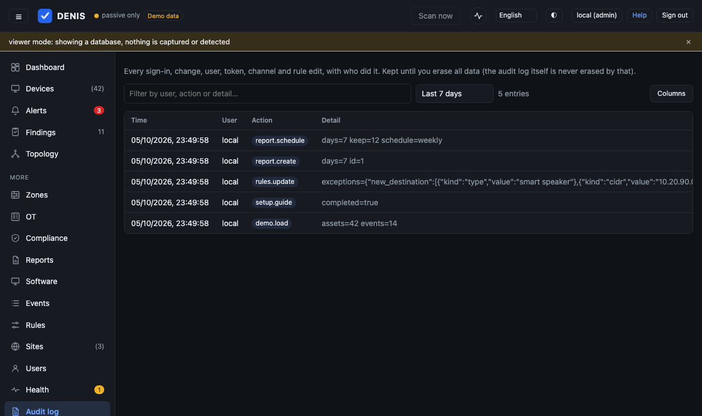

Every sign-in, change, user, token, channel and rule edit with who did it, filterable, the last 100 to 1000 entries.

## My account

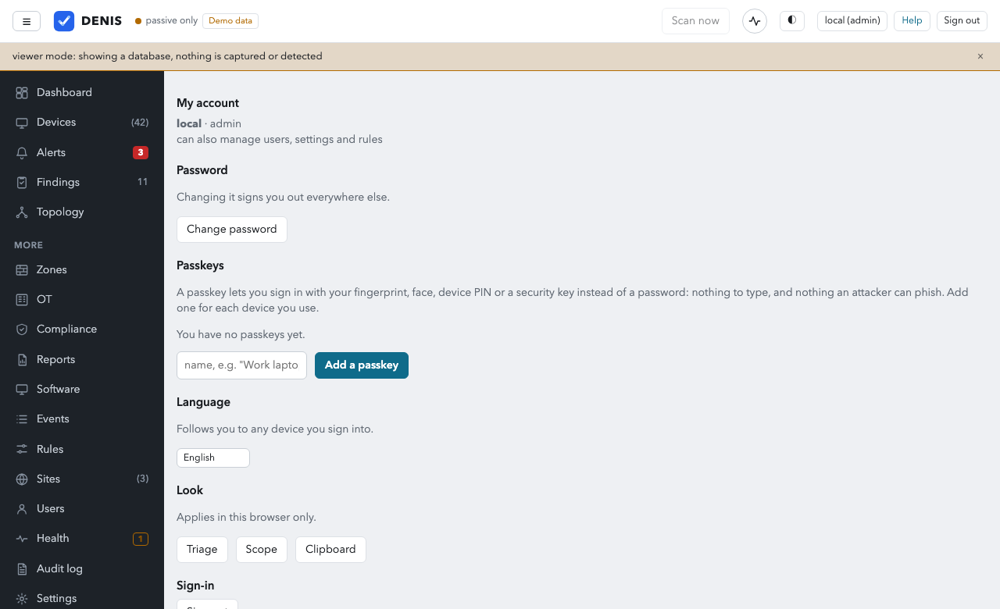

Click your name in the header. Here you change your **password** and manage your **passkeys**: sign in with a
fingerprint, face, device PIN or security key instead of a password, one per device ([details](security.md#passkeys)),
and an **authenticator app** as a second step after the password, with recovery codes ([details](security.md#authenticator-app-totp)).

## Reports

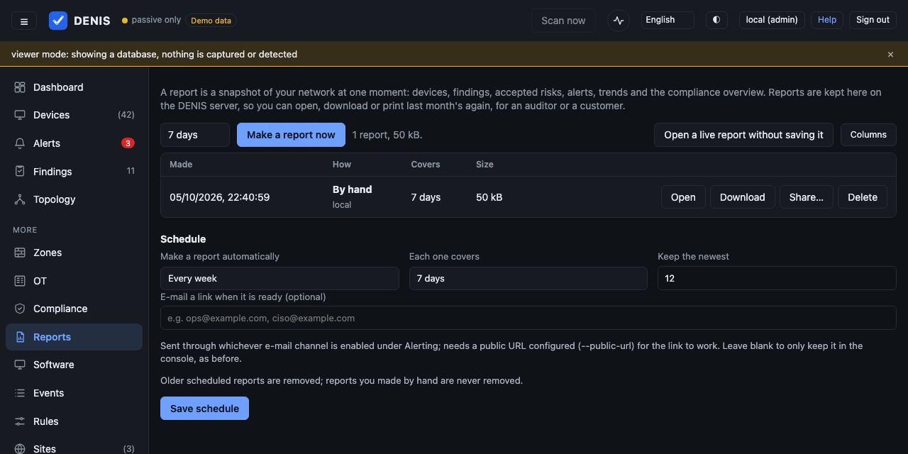

The **Reports** page (Analyze) keeps snapshots of your network on the DENIS server. A report is a self-contained
page: summary, compliance overview, findings, accepted risks, trends, devices by risk, alerts and lifecycle. It
carries your branding. **Open** it, **Download** it as one HTML file, or print it (or save it as PDF) to hand to a
client or an auditor.

* **Make a report now** (editors and administrators) for the last 7 days up to a year. The report is stored, so
  last month's is still there next month, exactly as it was.
* **Schedule** (administrators): every week or every month, covering a period you choose, optionally e-mailed as a
  link when ready. DENIS keeps the newest N scheduled reports and removes older ones; reports you made by hand are
  never removed. Deleting a report is an administrator's action and goes to the audit log.
* **Share…** (administrators) turns on a link that opens the report **without signing in** — the dialog says so
  plainly; **Stop sharing** invalidates it immediately.
* With *Settings → AI → Security reports* on, a saved report also carries a short AI-written summary; the live
  `/report` never does.
* Reports are kept in DENIS's database, so they are included in backups, and **Erase all data** removes them too.

`/report?days=7` still gives a live report that is not saved (see the [API](api.md)).
